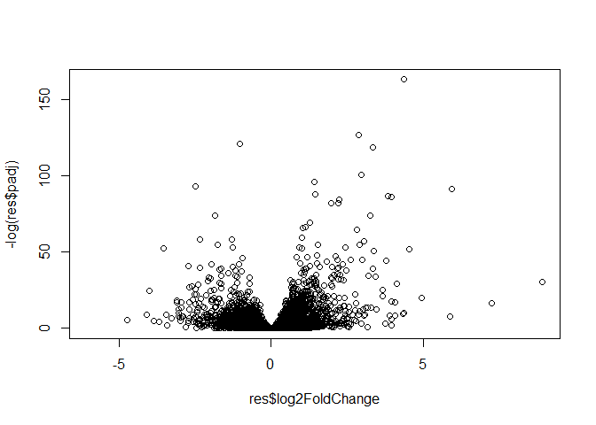
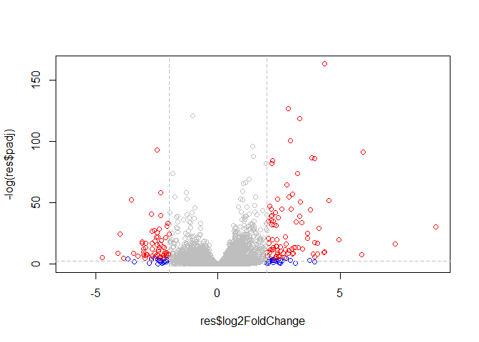

Class14
================

## Setup Bioconductor DESeq2

``` r
#eval=FALSE: R will ask to run this section of code

install.packages("BiocManager")
BiocManager::install()
# For this class, you'll also need DESeq2:
BiocManager::install("DESeq2")
```

``` r
library(BiocManager)
```

    ## Bioconductor version 3.10 (BiocManager 1.30.9), ?BiocManager::install for
    ##   help

# Data for todays class

``` r
counts <- read.csv("airway_scaledcounts.csv", stringsAsFactors = FALSE)
metadata <- read.csv("airway_metadata.csv", stringsAsFactors = FALSE)
```

``` r
head(counts)
```

    ##           ensgene SRR1039508 SRR1039509 SRR1039512 SRR1039513 SRR1039516
    ## 1 ENSG00000000003        723        486        904        445       1170
    ## 2 ENSG00000000005          0          0          0          0          0
    ## 3 ENSG00000000419        467        523        616        371        582
    ## 4 ENSG00000000457        347        258        364        237        318
    ## 5 ENSG00000000460         96         81         73         66        118
    ## 6 ENSG00000000938          0          0          1          0          2
    ##   SRR1039517 SRR1039520 SRR1039521
    ## 1       1097        806        604
    ## 2          0          0          0
    ## 3        781        417        509
    ## 4        447        330        324
    ## 5         94        102         74
    ## 6          0          0          0

How many genes do we have in the dataset?

``` r
nrow(counts)
```

    ## [1] 38694

How many experiemnts are in this dataset?

``` r
ncol(counts) - 1
```

    ## [1] 8

Lets make sure the metadata id col matches the colnames of counts

``` r
#The all function is useful for looking accross a vector of logicals
all(colnames(counts)[-1] == metadata$id)
```

    ## [1] TRUE

## Analysis: compare the control to the drug treated

First we need to access the columns of out countData that are contol and
then find their mean

``` r
metadata$dex == "control"
```

    ## [1]  TRUE FALSE  TRUE FALSE  TRUE FALSE  TRUE FALSE

``` r
#Get the control ids
control.id <- metadata[metadata$dex == "control", ]$id
control.id
```

    ## [1] "SRR1039508" "SRR1039512" "SRR1039516" "SRR1039520"

``` r
#Get the control data
head(counts[, control.id])
```

    ##   SRR1039508 SRR1039512 SRR1039516 SRR1039520
    ## 1        723        904       1170        806
    ## 2          0          0          0          0
    ## 3        467        616        582        417
    ## 4        347        364        318        330
    ## 5         96         73        118        102
    ## 6          0          1          2          0

``` r
#Get the mean of each row
control.mean <- rowSums(counts[,control.id])/length(control.id)
names(control.mean) <- counts$ensgene
```

``` r
#Now for the treated columns
treated.id <- metadata[metadata$dex == "treated", ]$id
treated.mean <- rowSums(counts[,treated.id])/length(treated.id)
names(treated.mean) <- counts$ensgene
```

Let’s store these together

``` r
meancounts <- data.frame(control.mean, treated.mean)
```

``` r
plot(meancounts$control.mean, meancounts$treated.mean)
```

<!-- -->

``` r
#A lot of data are concentrated around 0, so use a log scale to see all of the data
plot(meancounts$control.mean, meancounts$treated.mean, log = "xy")
```

    ## Warning in xy.coords(x, y, xlabel, ylabel, log): 15032 x values <= 0
    ## omitted from logarithmic plot

    ## Warning in xy.coords(x, y, xlabel, ylabel, log): 15281 y values <= 0
    ## omitted from logarithmic plot

<!-- -->

``` r
#devide by the log of each. If the  value is above 0 then the gene was more expressed in the treatment and if its below 0 then the gene is more expresses in the control
meancounts$log2fc <- log2(meancounts[,"treated.mean"]/meancounts[,"control.mean"])
head(meancounts)
```

    ##                 control.mean treated.mean      log2fc
    ## ENSG00000000003       900.75       658.00 -0.45303916
    ## ENSG00000000005         0.00         0.00         NaN
    ## ENSG00000000419       520.50       546.00  0.06900279
    ## ENSG00000000457       339.75       316.50 -0.10226805
    ## ENSG00000000460        97.25        78.75 -0.30441833
    ## ENSG00000000938         0.75         0.00        -Inf

There are a couple of “weird” results. Namely, the NaN (“not a number”)
and -Inf (negative infinity) results.

The NaN is returned when you divide by zero and try to take the log. The
-Inf is returned when you try to take the log of zero. It turns out that
there are a lot of genes with zero expression. Let’s filter our data to
remove these genes. Again inspect your result (and the intermediate
steps) to see if things make sense to you

``` r
#Test for finding ero entries

x <- c(5,8,0,5)
x == 0
```

    ## [1] FALSE FALSE  TRUE FALSE

``` r
which(x == 0)
```

    ## [1] 3

``` r
x <- data.frame(happy = c(5,6,0,0), sad = c(0,5,5,0))
x == 0
```

    ##      happy   sad
    ## [1,] FALSE  TRUE
    ## [2,] FALSE FALSE
    ## [3,]  TRUE FALSE
    ## [4,]  TRUE  TRUE

``` r
#Shows the row and column of TRUE values
which(x == 0, arr.ind = TRUE)
```

    ##      row col
    ## [1,]   3   1
    ## [2,]   4   1
    ## [3,]   1   2
    ## [4,]   4   2

Focus on the rows only that have 0 entries

``` r
unique(which(x == 0, arr.ind = TRUE)[,1])
```

    ## [1] 3 4 1

``` r
a <- data.frame(wanna = c(3,6,54,2,4,0,0), sleep = c(7,0,2,0,1,0,6))
which(a == 0, arr.ind = TRUE)
```

    ##      row col
    ## [1,]   6   1
    ## [2,]   7   1
    ## [3,]   2   2
    ## [4,]   4   2
    ## [5,]   6   2

``` r
#Apply to mean counts
to.rm <- unique(which(meancounts[,1:2] == 0, arr.ind = TRUE)[,1])
mycounts <- meancounts[-to.rm,]
head(mycounts)
```

    ##                 control.mean treated.mean      log2fc
    ## ENSG00000000003       900.75       658.00 -0.45303916
    ## ENSG00000000419       520.50       546.00  0.06900279
    ## ENSG00000000457       339.75       316.50 -0.10226805
    ## ENSG00000000460        97.25        78.75 -0.30441833
    ## ENSG00000000971      5219.00      6687.50  0.35769358
    ## ENSG00000001036      2327.00      1785.75 -0.38194109

A common threshold used for calling something differentially expressed
is a log2(FoldChange) of greater than 2 or less than -2. Let’s filter
the dataset both ways to see how many genes are up or down-regulated.

``` r
up.ind <- mycounts$log2fc > 2
down.ind <- mycounts$log2fc < (-2)
sum(up.ind)
```

    ## [1] 250

``` r
sum(down.ind)
```

    ## [1] 367

``` r
library("AnnotationDbi")
```

    ## Loading required package: stats4

    ## Loading required package: BiocGenerics

    ## Loading required package: parallel

    ## 
    ## Attaching package: 'BiocGenerics'

    ## The following objects are masked from 'package:parallel':
    ## 
    ##     clusterApply, clusterApplyLB, clusterCall, clusterEvalQ,
    ##     clusterExport, clusterMap, parApply, parCapply, parLapply,
    ##     parLapplyLB, parRapply, parSapply, parSapplyLB

    ## The following objects are masked from 'package:stats':
    ## 
    ##     IQR, mad, sd, var, xtabs

    ## The following objects are masked from 'package:base':
    ## 
    ##     anyDuplicated, append, as.data.frame, basename, cbind,
    ##     colnames, dirname, do.call, duplicated, eval, evalq, Filter,
    ##     Find, get, grep, grepl, intersect, is.unsorted, lapply, Map,
    ##     mapply, match, mget, order, paste, pmax, pmax.int, pmin,
    ##     pmin.int, Position, rank, rbind, Reduce, rownames, sapply,
    ##     setdiff, sort, table, tapply, union, unique, unsplit, which,
    ##     which.max, which.min

    ## Loading required package: Biobase

    ## Welcome to Bioconductor
    ## 
    ##     Vignettes contain introductory material; view with
    ##     'browseVignettes()'. To cite Bioconductor, see
    ##     'citation("Biobase")', and for packages 'citation("pkgname")'.

    ## Loading required package: IRanges

    ## Loading required package: S4Vectors

    ## 
    ## Attaching package: 'S4Vectors'

    ## The following object is masked from 'package:base':
    ## 
    ##     expand.grid

    ## 
    ## Attaching package: 'IRanges'

    ## The following object is masked from 'package:grDevices':
    ## 
    ##     windows

``` r
library("org.Hs.eg.db")
```

    ## 

This is the organism annotation package (“org”) for Homo sapiens (“Hs”),
organized as an AnnotationDbi database package (“db”), using Entrez Gene
IDs (“eg”) as primary key. To get a list of all available key types,
use:

``` r
columns(org.Hs.eg.db)
```

    ##  [1] "ACCNUM"       "ALIAS"        "ENSEMBL"      "ENSEMBLPROT" 
    ##  [5] "ENSEMBLTRANS" "ENTREZID"     "ENZYME"       "EVIDENCE"    
    ##  [9] "EVIDENCEALL"  "GENENAME"     "GO"           "GOALL"       
    ## [13] "IPI"          "MAP"          "OMIM"         "ONTOLOGY"    
    ## [17] "ONTOLOGYALL"  "PATH"         "PFAM"         "PMID"        
    ## [21] "PROSITE"      "REFSEQ"       "SYMBOL"       "UCSCKG"      
    ## [25] "UNIGENE"      "UNIPROT"

We can use the mapIds() function to add individual columns to our
results table. We provide the row names of our results table as a key,
and specify that keytype=ENSEMBL. The column argument tells the mapIds()
function which information we want, and the multiVals argument tells the
function what to do if there are multiple possible values for a single
input value. Here we ask to just give us back the first one that occurs
in the database.

``` r
mycounts$symbol <- mapIds(org.Hs.eg.db,
                     keys=row.names(mycounts), # Our genenames
                     keytype="ENSEMBL",        # The format of our genenames
                     column="SYMBOL",          # The new format we want to add
                     multiVals="first")
```

    ## 'select()' returned 1:many mapping between keys and columns

``` r
head(mycounts)
```

    ##                 control.mean treated.mean      log2fc   symbol
    ## ENSG00000000003       900.75       658.00 -0.45303916   TSPAN6
    ## ENSG00000000419       520.50       546.00  0.06900279     DPM1
    ## ENSG00000000457       339.75       316.50 -0.10226805    SCYL3
    ## ENSG00000000460        97.25        78.75 -0.30441833 C1orf112
    ## ENSG00000000971      5219.00      6687.50  0.35769358      CFH
    ## ENSG00000001036      2327.00      1785.75 -0.38194109    FUCA2

Now to finnaly use DESeq2

``` r
library(DESeq2)
```

    ## Loading required package: GenomicRanges

    ## Loading required package: GenomeInfoDb

    ## Loading required package: SummarizedExperiment

    ## Loading required package: DelayedArray

    ## Loading required package: matrixStats

    ## 
    ## Attaching package: 'matrixStats'

    ## The following objects are masked from 'package:Biobase':
    ## 
    ##     anyMissing, rowMedians

    ## Loading required package: BiocParallel

    ## 
    ## Attaching package: 'DelayedArray'

    ## The following objects are masked from 'package:matrixStats':
    ## 
    ##     colMaxs, colMins, colRanges, rowMaxs, rowMins, rowRanges

    ## The following objects are masked from 'package:base':
    ## 
    ##     aperm, apply, rowsum

``` r
citation("DESeq2")
```

    ## 
    ##   Love, M.I., Huber, W., Anders, S. Moderated estimation of fold
    ##   change and dispersion for RNA-seq data with DESeq2 Genome
    ##   Biology 15(12):550 (2014)
    ## 
    ## A BibTeX entry for LaTeX users is
    ## 
    ##   @Article{,
    ##     title = {Moderated estimation of fold change and dispersion for RNA-seq data with DESeq2},
    ##     author = {Michael I. Love and Wolfgang Huber and Simon Anders},
    ##     year = {2014},
    ##     journal = {Genome Biology},
    ##     doi = {10.1186/s13059-014-0550-8},
    ##     volume = {15},
    ##     issue = {12},
    ##     pages = {550},
    ##   }

Set up data for DESeq2 analysis

``` r
dds <- DESeqDataSetFromMatrix(countData=counts, 
                              colData=metadata, 
                              design=~dex, 
                              tidy=TRUE)
```

    ## converting counts to integer mode

    ## Warning in DESeqDataSet(se, design = design, ignoreRank): some variables in
    ## design formula are characters, converting to factors

``` r
dds
```

    ## class: DESeqDataSet 
    ## dim: 38694 8 
    ## metadata(1): version
    ## assays(1): counts
    ## rownames(38694): ENSG00000000003 ENSG00000000005 ...
    ##   ENSG00000283120 ENSG00000283123
    ## rowData names(0):
    ## colnames(8): SRR1039508 SRR1039509 ... SRR1039520 SRR1039521
    ## colData names(4): id dex celltype geo_id

Run DESeq

``` r
dds <- DESeq(dds)
```

    ## estimating size factors

    ## estimating dispersions

    ## gene-wise dispersion estimates

    ## mean-dispersion relationship

    ## final dispersion estimates

    ## fitting model and testing

``` r
res <- results(dds)
res
```

    ## log2 fold change (MLE): dex treated vs control 
    ## Wald test p-value: dex treated vs control 
    ## DataFrame with 38694 rows and 6 columns
    ##                          baseMean     log2FoldChange             lfcSE
    ##                         <numeric>          <numeric>         <numeric>
    ## ENSG00000000003  747.194195359907 -0.350703020686589 0.168245681332903
    ## ENSG00000000005                 0                 NA                NA
    ## ENSG00000000419  520.134160051965  0.206107766417874 0.101059218008481
    ## ENSG00000000457  322.664843927049 0.0245269479387461 0.145145067649738
    ## ENSG00000000460   87.682625164828 -0.147142049222083 0.257007253995456
    ## ...                           ...                ...               ...
    ## ENSG00000283115                 0                 NA                NA
    ## ENSG00000283116                 0                 NA                NA
    ## ENSG00000283119                 0                 NA                NA
    ## ENSG00000283120 0.974916032393564 -0.668258460516795  1.69456285242458
    ## ENSG00000283123                 0                 NA                NA
    ##                               stat             pvalue              padj
    ##                          <numeric>          <numeric>         <numeric>
    ## ENSG00000000003  -2.08446967499072 0.0371174658436988 0.163034808643509
    ## ENSG00000000005                 NA                 NA                NA
    ## ENSG00000000419   2.03947517583776 0.0414026263009679  0.17603166488093
    ## ENSG00000000457  0.168982303952169  0.865810560624016 0.961694238404893
    ## ENSG00000000460 -0.572520996721302  0.566969065259218  0.81584858763974
    ## ...                            ...                ...               ...
    ## ENSG00000283115                 NA                 NA                NA
    ## ENSG00000283116                 NA                 NA                NA
    ## ENSG00000283119                 NA                 NA                NA
    ## ENSG00000283120 -0.394354484733718  0.693319342567684                NA
    ## ENSG00000283123                 NA                 NA                NA

``` r
plot(res$log2FoldChange, res$padj)
```

<!-- -->

``` r
plot(res$log2FoldChange, -log(res$padj))
```

<!-- --> Add colors

``` r
mycols <- rep("gray", length(res$padj))
mycols[ abs(res$log2FoldChange) > 2 ]  <- "blue"
inds <- (res$padj < 0.01) & (abs(res$log2FoldChange) > 2 )
mycols[ inds ] <- "red"

plot(res$log2FoldChange, -log(res$padj), col = mycols)
abline(v=c(-2,2), col="gray", lty=2)
abline(h=-log(0.1), col="gray", lty=2)
```

<!-- -->
