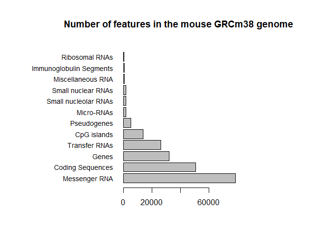
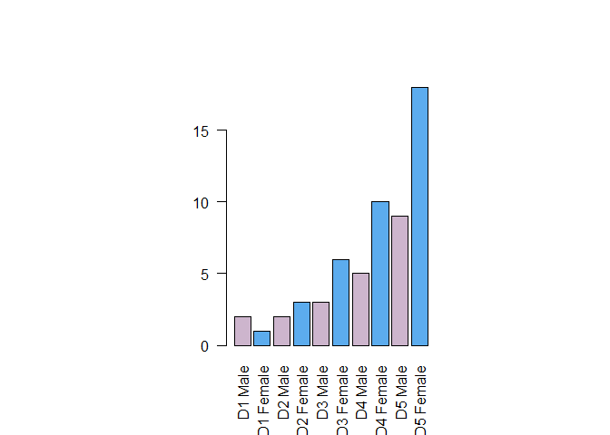
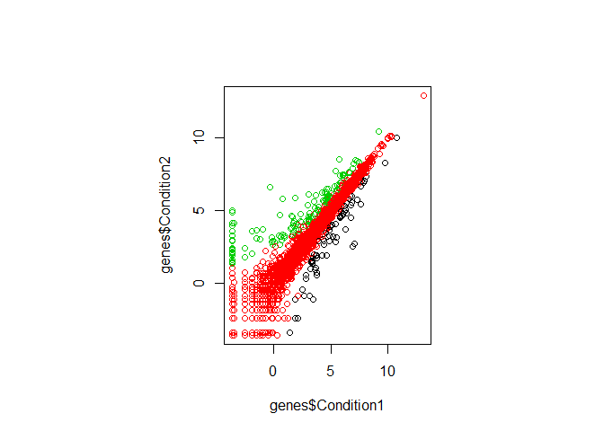

class05
================
Jelani Lyda
11/1/2019

\#Section 1 \#read the file

``` r
weight <- read.table(file = "bimm143_05_rstats/bimm143_05_rstats/weight_chart.txt", header = TRUE)

#plot data
plot(weight$Age, weight$Weight, type = "o", pch = 15, cex = 1.5, lwd = 2,
ylim = c(2,10), xlab = "Age (months)", ylab = "Weight (kg)", main = "Baby weight with age")
```

<!-- -->

``` r
#Section 2
par(mar = c(5,13,5,10))
mouse <- read.delim(file = "bimm143_05_rstats/bimm143_05_rstats/feature_counts.txt")
barplot(mouse$Count, 
        horiz = TRUE, 
        names.arg = mouse$Feature,
        main = "Number of features in the mouse GRCm38 genome",
        las = 1,
        cex.names = .9)
```

<!-- -->

``` r
#Section 3A
counts <- read.delim(file = "bimm143_05_rstats/bimm143_05_rstats/male_female_counts.txt")
barplot(counts$Count,
        names.arg = counts$Sample, 
        las = 2,
        col = c("thistle3", "steelblue2")
        )
```

<!-- -->

``` r
#Section 3B
genes <- read.table(file = "bimm143_05_rstats/bimm143_05_rstats/up_down_expression.txt", header = TRUE)
table(genes$State)
```

    ## 
    ##       down unchanging         up 
    ##         72       4997        127

``` r
plot(genes$Condition1, genes$Condition2,
     col = genes$State)
```

<!-- -->
