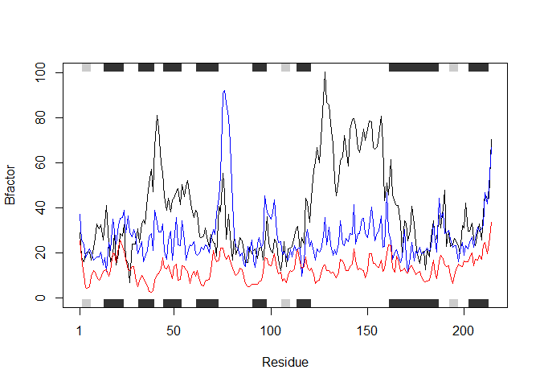
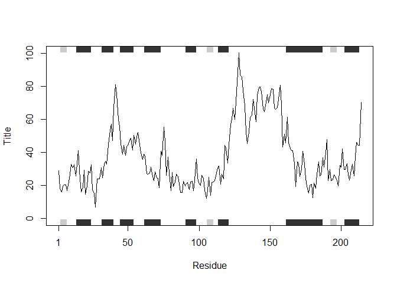

Class 6 R Functions
================
Jelani Lyda
10/18/2019

# This is a H1

This is my class 6 work. This will be **bold**

## This is a H2

### A level 3 heading H3

``` r
plot(1:10)
```

<!-- -->

``` r
read.csv(file = "test1.txt")
```

    ##   Col1 Col2 Col3
    ## 1    1    2    3
    ## 2    4    5    6
    ## 3    7    8    9
    ## 4    a    b    c

``` r
read.delim(file = "test2.txt", sep = "$")
```

    ##   Col1 Col2 Col3
    ## 1    1    2    3
    ## 2    4    5    6
    ## 3    7    8    9
    ## 4    a    b    c

``` r
read.table(file = "test3.txt")
```

    ##   V1 V2 V3
    ## 1  1  6  a
    ## 2  2  7  b
    ## 3  3  8  c
    ## 4  4  9  d
    ## 5  5 10  e

Our first silly function

``` r
add <- function(x, y = 1){
  #Sum the input of x and y
  x + y
}
```

``` r
add(10,10)
```

    ## [1] 20

``` r
add(c(5,6, 100, 334), y = 7000)
```

    ## [1] 7005 7006 7100 7334

``` r
rescale <- function(x) {
 rng <-range(x)
 (x - rng[1]) / (rng[2] - rng[1])
}

rescale(c(1,2,3,NA,10))
```

    ## [1] NA NA NA NA NA

``` r
rescale2 <- function(x) {
 rng <-range(x, na.rm = T)
 (x - rng[1]) / (rng[2] - rng[1])
}

rescale2(c(1,2,3,NA,10))
```

    ## [1] 0.0000000 0.1111111 0.2222222        NA 1.0000000

``` r
library(bio3d)
s1 <- read.pdb("4AKE") # kinase with drug
```

    ##   Note: Accessing on-line PDB file

``` r
s2 <- read.pdb("1AKE") # kinase no drug
```

    ##   Note: Accessing on-line PDB file
    ##    PDB has ALT records, taking A only, rm.alt=TRUE

``` r
s3 <- read.pdb("1E4Y") # kinase with drug
```

    ##   Note: Accessing on-line PDB file

``` r
s1.chainA <- trim.pdb(s1, chain="A", elety="CA")
s2.chainA <- trim.pdb(s2, chain="A", elety="CA")
s3.chainA <- trim.pdb(s3, chain="A", elety="CA")

s1.b <- s1.chainA$atom$b
s2.b <- s2.chainA$atom$b
s3.b <- s3.chainA$atom$b

plotb3(s1.b, sse=s1.chainA, typ="l", ylab="Bfactor")
```

<!-- -->

``` r
plotb3(s2.b, sse=s2.chainA, typ="l", ylab="Bfactor")
```

<!-- -->

``` r
plotb3(s3.b, sse=s3.chainA, typ="l", ylab="Bfactor")
```

<!-- -->

``` r
hc <- hclust( dist( rbind(s1.b, s2.b, s3.b) ) )
plot(hc)
```

<!-- -->

``` r
function_name <- function(){
  
}
```

``` r
plotb3(s1.b, sse=s1.chainA, typ="l", ylab="Bfactor")
points(s2.b, typ="l", col = "blue")
points(s3.b, typ="l", col = "red")
```

<!-- -->

``` r
library(bio3d)
graph_PDB <- function(pdb_protein, chain = "A", electy = "CA", typ = "l", ylab = "Bfactor"){
  #Reads a PDB file and outputs a graph (defult line chart) of a subset of the sequence
  #Input your PDB protein call name as the first input and any additional specifications
  #Read PDB file
  pdb_file <- read.pdb(pdb_protein)
  
  #Trim PDB Object
  s1.chainA <- trim.pdb(pdb_file, chain = chain, elety = "CA")
  
  #Select specific data
  s1.a <- s1.chainA$atom$b
  
  #Plot data
  plotb3(s1.a, sse=s1.chainA, typ= typ, ylab= ylab)
}

graph_PDB("4AKE")
```

    ##   Note: Accessing on-line PDB file

    ## Warning in get.pdb(file, path = tempdir(), verbose = FALSE): C:
    ## \Users\snowj\AppData\Local\Temp\RtmpkZRazb/4AKE.pdb exists. Skipping
    ## download

<!-- -->

``` r
#plotb3(s1.b, sse=s1.chainA, typ="l", ylab="Bfactor")
```

``` r
  pdb_file <- read.pdb("4AKE")
```

    ##   Note: Accessing on-line PDB file

    ## Warning in get.pdb(file, path = tempdir(), verbose = FALSE): C:
    ## \Users\snowj\AppData\Local\Temp\RtmpkZRazb/4AKE.pdb exists. Skipping
    ## download

``` r
  #Trim PDB Object
  s1 <- trim.pdb(pdb_file, chain = "A", elety = "CA")
  
  #Select specific data
  s1.a <- s1$atom$b
  
  #Plot data
  plotb3(s1.a, sse=s1.chainA, typ= "l", ylab= "Title")
```

<!-- -->
