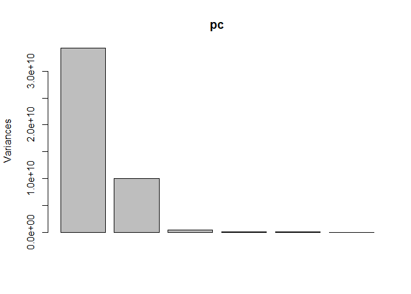
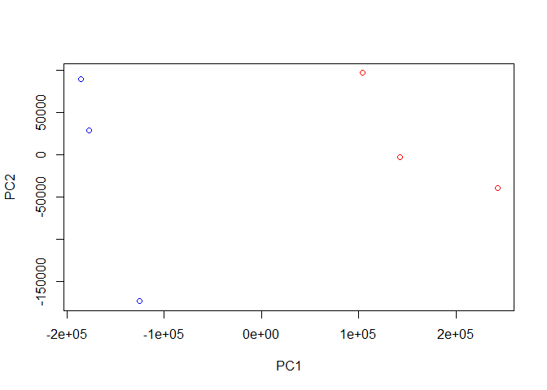

Class 15: Pathway Analysis from RNA-Seq Results
================

The data for for hands-on session comes from GEO entry: GSE37704, which
is associated with the following publication:

Trapnell C, Hendrickson DG, Sauvageau M, Goff L et al. “Differential
analysis of gene regulation at transcript resolution with RNA-seq”. Nat
Biotechnol 2013 Jan;31(1):46-53. PMID: 23222703

The authors report on differential analysis of lung fibroblasts in
response to loss of the developmental transcription factor HOXA1. Their
results and others indicate that HOXA1 is required for lung fibroblast
and HeLa cell cycle progression. In particular their analysis show that
“loss of HOXA1 results in significant expression level changes in
thousands of individual transcripts, along with isoform switching events
in key regulators of the cell cycle”. For our session we have used their
Sailfish gene-level estimated counts and hence are restricted to
protein-coding genes only.

Read in the data

``` r
countData <- read.csv("GSE37704_featurecounts.csv", row.names = 1)
colData <- read.csv("GSE37704_metadata.csv", row.names = 1)

head(countData)
```

    ##                 length SRR493366 SRR493367 SRR493368 SRR493369 SRR493370
    ## ENSG00000186092    918         0         0         0         0         0
    ## ENSG00000279928    718         0         0         0         0         0
    ## ENSG00000279457   1982        23        28        29        29        28
    ## ENSG00000278566    939         0         0         0         0         0
    ## ENSG00000273547    939         0         0         0         0         0
    ## ENSG00000187634   3214       124       123       205       207       212
    ##                 SRR493371
    ## ENSG00000186092         0
    ## ENSG00000279928         0
    ## ENSG00000279457        46
    ## ENSG00000278566         0
    ## ENSG00000273547         0
    ## ENSG00000187634       258

``` r
head(colData)
```

    ##               condition
    ## SRR493366 control_sirna
    ## SRR493367 control_sirna
    ## SRR493368 control_sirna
    ## SRR493369      hoxa1_kd
    ## SRR493370      hoxa1_kd
    ## SRR493371      hoxa1_kd

Remove the length columun from countData because it is not needed

``` r
#Don't change the data and then put it in the same variable because it overwrites the data
countData <- countData[,-1]
head(countData)
```

    ##                 SRR493366 SRR493367 SRR493368 SRR493369 SRR493370
    ## ENSG00000186092         0         0         0         0         0
    ## ENSG00000279928         0         0         0         0         0
    ## ENSG00000279457        23        28        29        29        28
    ## ENSG00000278566         0         0         0         0         0
    ## ENSG00000273547         0         0         0         0         0
    ## ENSG00000187634       124       123       205       207       212
    ##                 SRR493371
    ## ENSG00000186092         0
    ## ENSG00000279928         0
    ## ENSG00000279457        46
    ## ENSG00000278566         0
    ## ENSG00000273547         0
    ## ENSG00000187634       258

Need to remove the genes that have 0s for every experiment

``` r
countData <- countData[rowSums(countData) > 0,]
nrow(countData)
```

    ## [1] 15975

15975 genes is alot to plot so let’s use principal componet analysis on
the data to see if the controls and experiment are different

``` r
#t = transpose, prcomp needs the data to be in columns
pc <- prcomp(t(countData))
plot(pc)
```

<!-- -->

``` r
summary(pc)
```

    ## Importance of components:
    ##                              PC1       PC2       PC3       PC4      PC5
    ## Standard deviation     1.852e+05 1.001e+05 1.998e+04 6.886e+03 5.15e+03
    ## Proportion of Variance 7.659e-01 2.235e-01 8.920e-03 1.060e-03 5.90e-04
    ## Cumulative Proportion  7.659e-01 9.894e-01 9.983e-01 9.994e-01 1.00e+00
    ##                              PC6
    ## Standard deviation     9.558e-10
    ## Proportion of Variance 0.000e+00
    ## Cumulative Proportion  1.000e+00

``` r
mycols = c(rep("blue", 3), rep("red", 3))
plot(pc$x[,1:2], col = mycols)
```

<!-- -->

\#\#Differential expression analysis

``` r
library(DESeq2)
```

    ## Loading required package: S4Vectors

    ## Loading required package: stats4

    ## Loading required package: BiocGenerics

    ## Loading required package: parallel

    ## 
    ## Attaching package: 'BiocGenerics'

    ## The following objects are masked from 'package:parallel':
    ## 
    ##     clusterApply, clusterApplyLB, clusterCall, clusterEvalQ,
    ##     clusterExport, clusterMap, parApply, parCapply, parLapply,
    ##     parLapplyLB, parRapply, parSapply, parSapplyLB

    ## The following objects are masked from 'package:stats':
    ## 
    ##     IQR, mad, sd, var, xtabs

    ## The following objects are masked from 'package:base':
    ## 
    ##     anyDuplicated, append, as.data.frame, basename, cbind,
    ##     colnames, dirname, do.call, duplicated, eval, evalq, Filter,
    ##     Find, get, grep, grepl, intersect, is.unsorted, lapply, Map,
    ##     mapply, match, mget, order, paste, pmax, pmax.int, pmin,
    ##     pmin.int, Position, rank, rbind, Reduce, rownames, sapply,
    ##     setdiff, sort, table, tapply, union, unique, unsplit, which,
    ##     which.max, which.min

    ## 
    ## Attaching package: 'S4Vectors'

    ## The following object is masked from 'package:base':
    ## 
    ##     expand.grid

    ## Loading required package: IRanges

    ## 
    ## Attaching package: 'IRanges'

    ## The following object is masked from 'package:grDevices':
    ## 
    ##     windows

    ## Loading required package: GenomicRanges

    ## Loading required package: GenomeInfoDb

    ## Loading required package: SummarizedExperiment

    ## Loading required package: Biobase

    ## Welcome to Bioconductor
    ## 
    ##     Vignettes contain introductory material; view with
    ##     'browseVignettes()'. To cite Bioconductor, see
    ##     'citation("Biobase")', and for packages 'citation("pkgname")'.

    ## Loading required package: DelayedArray

    ## Loading required package: matrixStats

    ## 
    ## Attaching package: 'matrixStats'

    ## The following objects are masked from 'package:Biobase':
    ## 
    ##     anyMissing, rowMedians

    ## Loading required package: BiocParallel

    ## 
    ## Attaching package: 'DelayedArray'

    ## The following objects are masked from 'package:matrixStats':
    ## 
    ##     colMaxs, colMins, colRanges, rowMaxs, rowMins, rowRanges

    ## The following objects are masked from 'package:base':
    ## 
    ##     aperm, apply, rowsum

``` r
dds <- DESeqDataSetFromMatrix(countData = countData, 
                              colData = colData,
                              design = ~condition)
dds <- DESeq(dds)
```

    ## estimating size factors

    ## estimating dispersions

    ## gene-wise dispersion estimates

    ## mean-dispersion relationship

    ## final dispersion estimates

    ## fitting model and testing

``` r
dds
```

    ## class: DESeqDataSet 
    ## dim: 15975 6 
    ## metadata(1): version
    ## assays(4): counts mu H cooks
    ## rownames(15975): ENSG00000279457 ENSG00000187634 ...
    ##   ENSG00000276345 ENSG00000271254
    ## rowData names(22): baseMean baseVar ... deviance maxCooks
    ## colnames(6): SRR493366 SRR493367 ... SRR493370 SRR493371
    ## colData names(2): condition sizeFactor

``` r
res <- results(dds)
summary(res)
```

    ## 
    ## out of 15975 with nonzero total read count
    ## adjusted p-value < 0.1
    ## LFC > 0 (up)       : 4349, 27%
    ## LFC < 0 (down)     : 4396, 28%
    ## outliers [1]       : 0, 0%
    ## low counts [2]     : 1237, 7.7%
    ## (mean count < 0)
    ## [1] see 'cooksCutoff' argument of ?results
    ## [2] see 'independentFiltering' argument of ?results

\#\#Volcano plot summary

``` r
plot( res$log2FoldChange, -log(res$padj) )
```

<!-- -->

\#Add color

``` r
# Make a color vector for all genes
mycols <- rep("gray", nrow(res) )

# Color red the genes with absolute fold change above 2
mycols[ abs(res$log2FoldChange) > 2 ] <- "red"

# Color blue those with adjusted p-value less than 0.01
#  and absolute fold change more than 2
inds <- (res$padj < 0.01) & (abs(res$log2FoldChange) > 2 )
mycols[ inds ] <- "blue"

plot( res$log2FoldChange, -log(res$padj), col=mycols, xlab="Log2(FoldChange)", ylab="-Log(P-value)" )
```

<!-- -->

\#Add gene annotations

``` r
library("AnnotationDbi")
library("org.Hs.eg.db")
```

    ## 

``` r
columns(org.Hs.eg.db)
```

    ##  [1] "ACCNUM"       "ALIAS"        "ENSEMBL"      "ENSEMBLPROT" 
    ##  [5] "ENSEMBLTRANS" "ENTREZID"     "ENZYME"       "EVIDENCE"    
    ##  [9] "EVIDENCEALL"  "GENENAME"     "GO"           "GOALL"       
    ## [13] "IPI"          "MAP"          "OMIM"         "ONTOLOGY"    
    ## [17] "ONTOLOGYALL"  "PATH"         "PFAM"         "PMID"        
    ## [21] "PROSITE"      "REFSEQ"       "SYMBOL"       "UCSCKG"      
    ## [25] "UNIGENE"      "UNIPROT"

``` r
res$symbol = mapIds(org.Hs.eg.db,
                    keys= row.names(res),  #where are your gene IDs?
                    keytype="ENSEMBL", #what format are your gene IDs?
                    column= "SYMBOL",   #what format do you want the names changed to?   
                    multiVals="first")  #If there are more than one name, which one do you pick?
```

    ## 'select()' returned 1:many mapping between keys and columns

``` r
res$entrez = mapIds(org.Hs.eg.db,
                    keys= row.names(res),
                    keytype="ENSEMBL",
                    column="ENTREZID",
                    multiVals="first")
```

    ## 'select()' returned 1:many mapping between keys and columns

``` r
head(res, 10)
```

    ## log2 fold change (MLE): condition hoxa1 kd vs control sirna 
    ## Wald test p-value: condition hoxa1 kd vs control sirna 
    ## DataFrame with 10 rows and 8 columns
    ##                          baseMean     log2FoldChange              lfcSE
    ##                         <numeric>          <numeric>          <numeric>
    ## ENSG00000279457  29.9135794276176   0.17925708367269  0.324821565250145
    ## ENSG00000187634  183.229649921658  0.426457118403306  0.140265820376892
    ## ENSG00000188976  1651.18807619944 -0.692720464846366 0.0548465415913946
    ## ENSG00000187961  209.637938486147  0.729755610585225  0.131859899969345
    ## ENSG00000187583  47.2551232589398 0.0405765278756312  0.271892808601774
    ## ENSG00000187642  11.9797501642461  0.542810491577363  0.521559849534146
    ## ENSG00000188290  108.922127976716    2.0570638345631  0.196905312993839
    ## ENSG00000187608   350.71686801731  0.257383686481771  0.102726560033541
    ## ENSG00000188157    9128.439421961  0.389908792022773 0.0467163395511376
    ## ENSG00000237330 0.158192358990472  0.785955208142751    4.0804728567969
    ##                              stat               pvalue
    ##                         <numeric>            <numeric>
    ## ENSG00000279457 0.551863246932648    0.581042050747032
    ## ENSG00000187634  3.04034951107421  0.00236303749730996
    ## ENSG00000188976 -12.6301576133481 1.43989540156582e-36
    ## ENSG00000187961  5.53432552849563  3.1242824807768e-08
    ## ENSG00000187583 0.149237223611387    0.881366448669148
    ## ENSG00000187642  1.04074439790984    0.297994191720983
    ## ENSG00000188290  10.4469696794188 1.51281875407629e-25
    ## ENSG00000187608  2.50552229528308   0.0122270689409846
    ## ENSG00000188157  8.34630443585938 7.04321148758242e-17
    ## ENSG00000237330 0.192613757210411    0.847261469988086
    ##                                 padj      symbol      entrez
    ##                            <numeric> <character> <character>
    ## ENSG00000279457      0.6865547778329          NA          NA
    ## ENSG00000187634  0.00515718149494361      SAMD11      148398
    ## ENSG00000188976  1.7654890539332e-35       NOC2L       26155
    ## ENSG00000187961 1.13412993107607e-07      KLHL17      339451
    ## ENSG00000187583    0.919030615571381     PLEKHN1       84069
    ## ENSG00000187642    0.403379309754068       PERM1       84808
    ## ENSG00000188290  1.3053818968136e-24        HES4       57801
    ## ENSG00000187608   0.0237452288907934       ISG15        9636
    ## ENSG00000188157 4.21962808552804e-16        AGRN      375790
    ## ENSG00000237330                   NA      RNF223      401934

\#\#Pathway analysis

``` r
# Run in your R console (i.e. not your Rmarkdown doc!)
#BiocManager::install( c("pathview", "gage", "gageData") )
library(pathview)
```

    ## ##############################################################################
    ## Pathview is an open source software package distributed under GNU General
    ## Public License version 3 (GPLv3). Details of GPLv3 is available at
    ## http://www.gnu.org/licenses/gpl-3.0.html. Particullary, users are required to
    ## formally cite the original Pathview paper (not just mention it) in publications
    ## or products. For details, do citation("pathview") within R.
    ## 
    ## The pathview downloads and uses KEGG data. Non-academic uses may require a KEGG
    ## license agreement (details at http://www.kegg.jp/kegg/legal.html).
    ## ##############################################################################

``` r
library(gage)
library(gageData)
```

``` r
data(kegg.sets.hs)
data(sigmet.idx.hs)

# Focus on signaling and metabolic pathways only
kegg.sets.hs = kegg.sets.hs[sigmet.idx.hs]

# Examine the first 3 pathways
head(kegg.sets.hs, 3)
```

    ## $`hsa00232 Caffeine metabolism`
    ## [1] "10"   "1544" "1548" "1549" "1553" "7498" "9"   
    ## 
    ## $`hsa00983 Drug metabolism - other enzymes`
    ##  [1] "10"     "1066"   "10720"  "10941"  "151531" "1548"   "1549"  
    ##  [8] "1551"   "1553"   "1576"   "1577"   "1806"   "1807"   "1890"  
    ## [15] "221223" "2990"   "3251"   "3614"   "3615"   "3704"   "51733" 
    ## [22] "54490"  "54575"  "54576"  "54577"  "54578"  "54579"  "54600" 
    ## [29] "54657"  "54658"  "54659"  "54963"  "574537" "64816"  "7083"  
    ## [36] "7084"   "7172"   "7363"   "7364"   "7365"   "7366"   "7367"  
    ## [43] "7371"   "7372"   "7378"   "7498"   "79799"  "83549"  "8824"  
    ## [50] "8833"   "9"      "978"   
    ## 
    ## $`hsa00230 Purine metabolism`
    ##   [1] "100"    "10201"  "10606"  "10621"  "10622"  "10623"  "107"   
    ##   [8] "10714"  "108"    "10846"  "109"    "111"    "11128"  "11164" 
    ##  [15] "112"    "113"    "114"    "115"    "122481" "122622" "124583"
    ##  [22] "132"    "158"    "159"    "1633"   "171568" "1716"   "196883"
    ##  [29] "203"    "204"    "205"    "221823" "2272"   "22978"  "23649" 
    ##  [36] "246721" "25885"  "2618"   "26289"  "270"    "271"    "27115" 
    ##  [43] "272"    "2766"   "2977"   "2982"   "2983"   "2984"   "2986"  
    ##  [50] "2987"   "29922"  "3000"   "30833"  "30834"  "318"    "3251"  
    ##  [57] "353"    "3614"   "3615"   "3704"   "377841" "471"    "4830"  
    ##  [64] "4831"   "4832"   "4833"   "4860"   "4881"   "4882"   "4907"  
    ##  [71] "50484"  "50940"  "51082"  "51251"  "51292"  "5136"   "5137"  
    ##  [78] "5138"   "5139"   "5140"   "5141"   "5142"   "5143"   "5144"  
    ##  [85] "5145"   "5146"   "5147"   "5148"   "5149"   "5150"   "5151"  
    ##  [92] "5152"   "5153"   "5158"   "5167"   "5169"   "51728"  "5198"  
    ##  [99] "5236"   "5313"   "5315"   "53343"  "54107"  "5422"   "5424"  
    ## [106] "5425"   "5426"   "5427"   "5430"   "5431"   "5432"   "5433"  
    ## [113] "5434"   "5435"   "5436"   "5437"   "5438"   "5439"   "5440"  
    ## [120] "5441"   "5471"   "548644" "55276"  "5557"   "5558"   "55703" 
    ## [127] "55811"  "55821"  "5631"   "5634"   "56655"  "56953"  "56985" 
    ## [134] "57804"  "58497"  "6240"   "6241"   "64425"  "646625" "654364"
    ## [141] "661"    "7498"   "8382"   "84172"  "84265"  "84284"  "84618" 
    ## [148] "8622"   "8654"   "87178"  "8833"   "9060"   "9061"   "93034" 
    ## [155] "953"    "9533"   "954"    "955"    "956"    "957"    "9583"  
    ## [162] "9615"

The main gage() function requires a named vector of fold changes, where
the names of the values are the Entrez gene IDs.

Note that we used the mapIDs() function above to obtain Entrez gene IDs
(stored in
res\(entrez) and we have the fold change results from DESeq2 analysis (stored in res\)log2FoldChange).

``` r
foldchanges = res$log2FoldChange
names(foldchanges) = res$entrez
head(foldchanges)
```

    ##        <NA>      148398       26155      339451       84069       84808 
    ##  0.17925708  0.42645712 -0.69272046  0.72975561  0.04057653  0.54281049

``` r
# Get the results
keggres = gage(foldchanges, gsets=kegg.sets.hs)
attributes(keggres)
```

    ## $names
    ## [1] "greater" "less"    "stats"

Show all the pathways that are down regulated

``` r
keggres$less
```

    ##                                                                        p.geomean
    ## hsa04110 Cell cycle                                                 8.995727e-06
    ## hsa03030 DNA replication                                            9.424076e-05
    ## hsa03013 RNA transport                                              1.246882e-03
    ## hsa03440 Homologous recombination                                   3.066756e-03
    ## hsa04114 Oocyte meiosis                                             3.784520e-03
    ## hsa00010 Glycolysis / Gluconeogenesis                               8.961413e-03
    ## hsa00240 Pyrimidine metabolism                                      9.417321e-03
    ## hsa00670 One carbon pool by folate                                  1.054523e-02
    ## hsa00280 Valine, leucine and isoleucine degradation                 1.374929e-02
    ## hsa03430 Mismatch repair                                            1.457274e-02
    ## hsa00970 Aminoacyl-tRNA biosynthesis                                2.053198e-02
    ## hsa00071 Fatty acid metabolism                                      2.611816e-02
    ## hsa03010 Ribosome                                                   2.863778e-02
    ## hsa00310 Lysine degradation                                         3.597557e-02
    ## hsa03420 Nucleotide excision repair                                 4.180655e-02
    ## hsa00620 Pyruvate metabolism                                        4.399716e-02
    ## hsa03040 Spliceosome                                                4.564582e-02
    ## hsa00760 Nicotinate and nicotinamide metabolism                     4.702794e-02
    ## hsa00640 Propanoate metabolism                                      4.710388e-02
    ## hsa03410 Base excision repair                                       5.458296e-02
    ## hsa00020 Citrate cycle (TCA cycle)                                  6.440428e-02
    ## hsa00290 Valine, leucine and isoleucine biosynthesis                7.404382e-02
    ## hsa03008 Ribosome biogenesis in eukaryotes                          7.930857e-02
    ## hsa00260 Glycine, serine and threonine metabolism                   8.882605e-02
    ## hsa00250 Alanine, aspartate and glutamate metabolism                9.040455e-02
    ## hsa04530 Tight junction                                             1.017351e-01
    ## hsa00230 Purine metabolism                                          1.048730e-01
    ## hsa00350 Tyrosine metabolism                                        1.067713e-01
    ## hsa00340 Histidine metabolism                                       1.204346e-01
    ## hsa00630 Glyoxylate and dicarboxylate metabolism                    1.228644e-01
    ## hsa04670 Leukocyte transendothelial migration                       1.299655e-01
    ## hsa04146 Peroxisome                                                 1.344336e-01
    ## hsa01040 Biosynthesis of unsaturated fatty acids                    1.485063e-01
    ## hsa00650 Butanoate metabolism                                       1.532328e-01
    ## hsa00380 Tryptophan metabolism                                      1.562580e-01
    ## hsa04810 Regulation of actin cytoskeleton                           1.590377e-01
    ## hsa00270 Cysteine and methionine metabolism                         1.626912e-01
    ## hsa00040 Pentose and glucuronate interconversions                   1.666234e-01
    ## hsa00982 Drug metabolism - cytochrome P450                          1.667808e-01
    ## hsa04270 Vascular smooth muscle contraction                         1.677717e-01
    ## hsa00360 Phenylalanine metabolism                                   1.739035e-01
    ## hsa00052 Galactose metabolism                                       1.787878e-01
    ## hsa00030 Pentose phosphate pathway                                  1.819294e-01
    ## hsa03050 Proteasome                                                 1.826388e-01
    ## hsa03018 RNA degradation                                            2.119358e-01
    ## hsa03015 mRNA surveillance pathway                                  2.169110e-01
    ## hsa03450 Non-homologous end-joining                                 2.182244e-01
    ## hsa00330 Arginine and proline metabolism                            2.239948e-01
    ## hsa04914 Progesterone-mediated oocyte maturation                    2.292991e-01
    ## hsa04115 p53 signaling pathway                                      2.385016e-01
    ## hsa00500 Starch and sucrose metabolism                              2.414361e-01
    ## hsa00770 Pantothenate and CoA biosynthesis                          2.434758e-01
    ## hsa04514 Cell adhesion molecules (CAMs)                             2.474949e-01
    ## hsa00601 Glycosphingolipid biosynthesis - lacto and neolacto series 2.477532e-01
    ## hsa00450 Selenocompound metabolism                                  2.669485e-01
    ## hsa00565 Ether lipid metabolism                                     2.761608e-01
    ## hsa00120 Primary bile acid biosynthesis                             2.869631e-01
    ## hsa04120 Ubiquitin mediated proteolysis                             2.981724e-01
    ## hsa00592 alpha-Linolenic acid metabolism                            3.326133e-01
    ## hsa04520 Adherens junction                                          3.330737e-01
    ## hsa00920 Sulfur metabolism                                          3.337487e-01
    ## hsa00512 Mucin type O-Glycan biosynthesis                           3.457714e-01
    ## hsa03060 Protein export                                             3.571696e-01
    ## hsa00480 Glutathione metabolism                                     3.604744e-01
    ## hsa04122 Sulfur relay system                                        3.657723e-01
    ## hsa00740 Riboflavin metabolism                                      3.746995e-01
    ## hsa03020 RNA polymerase                                             3.877460e-01
    ## hsa00563 Glycosylphosphatidylinositol(GPI)-anchor biosynthesis      3.883562e-01
    ## hsa00900 Terpenoid backbone biosynthesis                            3.906596e-01
    ## hsa04130 SNARE interactions in vesicular transport                  3.999324e-01
    ## hsa00983 Drug metabolism - other enzymes                            4.189807e-01
    ## hsa00410 beta-Alanine metabolism                                    4.231946e-01
    ## hsa00561 Glycerolipid metabolism                                    4.287564e-01
    ## hsa00860 Porphyrin and chlorophyll metabolism                       4.300937e-01
    ## hsa04970 Salivary secretion                                         4.348692e-01
    ## hsa03320 PPAR signaling pathway                                     4.501352e-01
    ## hsa00051 Fructose and mannose metabolism                            4.623485e-01
    ## hsa04730 Long-term depression                                       4.651151e-01
    ## hsa00910 Nitrogen metabolism                                        4.683280e-01
    ## hsa00520 Amino sugar and nucleotide sugar metabolism                4.691828e-01
    ## hsa04977 Vitamin digestion and absorption                           4.806438e-01
    ## hsa04744 Phototransduction                                          4.823095e-01
    ## hsa04540 Gap junction                                               5.241673e-01
    ## hsa04614 Renin-angiotensin system                                   5.389882e-01
    ## hsa04141 Protein processing in endoplasmic reticulum                5.678450e-01
    ## hsa04666 Fc gamma R-mediated phagocytosis                           5.783759e-01
    ## hsa04973 Carbohydrate digestion and absorption                      5.893714e-01
    ## hsa04622 RIG-I-like receptor signaling pathway                      5.962652e-01
    ## hsa00514 Other types of O-glycan biosynthesis                       6.129303e-01
    ## hsa04710 Circadian rhythm - mammal                                  6.169389e-01
    ## hsa00534 Glycosaminoglycan biosynthesis - heparan sulfate           6.193013e-01
    ## hsa00600 Sphingolipid metabolism                                    6.246307e-01
    ## hsa04962 Vasopressin-regulated water reabsorption                   6.255125e-01
    ## hsa00533 Glycosaminoglycan biosynthesis - keratan sulfate           6.344769e-01
    ## hsa04664 Fc epsilon RI signaling pathway                            6.428860e-01
    ## hsa00562 Inositol phosphate metabolism                              6.485849e-01
    ## hsa04660 T cell receptor signaling pathway                          6.516208e-01
    ## hsa04210 Apoptosis                                                  6.711598e-01
    ## hsa04360 Axon guidance                                              6.748515e-01
    ## hsa04912 GnRH signaling pathway                                     6.804641e-01
    ## hsa03022 Basal transcription factors                                6.863681e-01
    ## hsa00190 Oxidative phosphorylation                                  6.889049e-01
    ## hsa04510 Focal adhesion                                             6.914370e-01
    ## hsa04260 Cardiac muscle contraction                                 6.973077e-01
    ## hsa00564 Glycerophospholipid metabolism                             6.990692e-01
    ## hsa04145 Phagosome                                                  7.039111e-01
    ## hsa00100 Steroid biosynthesis                                       7.105477e-01
    ## hsa04964 Proximal tubule bicarbonate reclamation                    7.230065e-01
    ## hsa04971 Gastric acid secretion                                     7.231647e-01
    ## hsa00532 Glycosaminoglycan biosynthesis - chondroitin sulfate       7.438291e-01
    ## hsa04720 Long-term potentiation                                     7.456958e-01
    ## hsa04020 Calcium signaling pathway                                  7.591572e-01
    ## hsa04910 Insulin signaling pathway                                  7.594729e-01
    ## hsa04722 Neurotrophin signaling pathway                             7.613321e-01
    ## hsa04320 Dorso-ventral axis formation                               7.672898e-01
    ## hsa04150 mTOR signaling pathway                                     7.687395e-01
    ## hsa00591 Linoleic acid metabolism                                   7.705910e-01
    ## hsa04975 Fat digestion and absorption                               7.865938e-01
    ## hsa04742 Taste transduction                                         7.876084e-01
    ## hsa04140 Regulation of autophagy                                    7.881976e-01
    ## hsa04620 Toll-like receptor signaling pathway                       7.903247e-01
    ## hsa04672 Intestinal immune network for IgA production               7.913909e-01
    ## hsa04144 Endocytosis                                                7.938841e-01
    ## hsa04972 Pancreatic secretion                                       8.049707e-01
    ## hsa04960 Aldosterone-regulated sodium reabsorption                  8.071582e-01
    ## hsa04966 Collecting duct acid secretion                             8.107963e-01
    ## hsa00603 Glycosphingolipid biosynthesis - globo series              8.134152e-01
    ## hsa04070 Phosphatidylinositol signaling system                      8.262394e-01
    ## hsa00980 Metabolism of xenobiotics by cytochrome P450               8.548482e-01
    ## hsa00590 Arachidonic acid metabolism                                8.568157e-01
    ## hsa04920 Adipocytokine signaling pathway                            8.605868e-01
    ## hsa04974 Protein digestion and absorption                           8.630799e-01
    ## hsa04350 TGF-beta signaling pathway                                 8.677581e-01
    ## hsa00604 Glycosphingolipid biosynthesis - ganglio series            8.735394e-01
    ## hsa04512 ECM-receptor interaction                                   8.849464e-01
    ## hsa04623 Cytosolic DNA-sensing pathway                              8.920085e-01
    ## hsa00830 Retinol metabolism                                         9.032622e-01
    ## hsa04380 Osteoclast differentiation                                 9.108642e-01
    ## hsa00510 N-Glycan biosynthesis                                      9.174501e-01
    ## hsa04012 ErbB signaling pathway                                     9.196548e-01
    ## hsa04610 Complement and coagulation cascades                        9.277499e-01
    ## hsa04612 Antigen processing and presentation                        9.294816e-01
    ## hsa04370 VEGF signaling pathway                                     9.295042e-01
    ## hsa04650 Natural killer cell mediated cytotoxicity                  9.337780e-01
    ## hsa04310 Wnt signaling pathway                                      9.350211e-01
    ## hsa04340 Hedgehog signaling pathway                                 9.356681e-01
    ## hsa04621 NOD-like receptor signaling pathway                        9.384033e-01
    ## hsa02010 ABC transporters                                           9.516606e-01
    ## hsa04062 Chemokine signaling pathway                                9.593557e-01
    ## hsa00531 Glycosaminoglycan degradation                              9.619845e-01
    ## hsa00511 Other glycan degradation                                   9.636548e-01
    ## hsa04662 B cell receptor signaling pathway                          9.659757e-01
    ## hsa04010 MAPK signaling pathway                                     9.700193e-01
    ## hsa04740 Olfactory transduction                                     9.781777e-01
    ## hsa04976 Bile secretion                                             9.802670e-01
    ## hsa04916 Melanogenesis                                              9.806002e-01
    ## hsa04330 Notch signaling pathway                                    9.812527e-01
    ## hsa04142 Lysosome                                                   9.898926e-01
    ## hsa00140 Steroid hormone biosynthesis                               9.927449e-01
    ## hsa04630 Jak-STAT signaling pathway                                 9.947979e-01
    ## hsa04640 Hematopoietic cell lineage                                 9.971772e-01
    ## hsa00232 Caffeine metabolism                                                  NA
    ## hsa00300 Lysine biosynthesis                                                  NA
    ## hsa00130 Ubiquinone and other terpenoid-quinone biosynthesis                  NA
    ## hsa00430 Taurine and hypotaurine metabolism                                   NA
    ## hsa00053 Ascorbate and aldarate metabolism                                    NA
    ## hsa00785 Lipoic acid metabolism                                               NA
    ## hsa00460 Cyanoamino acid metabolism                                           NA
    ## hsa00472 D-Arginine and D-ornithine metabolism                                NA
    ## hsa00790 Folate biosynthesis                                                  NA
    ## hsa00061 Fatty acid biosynthesis                                              NA
    ## hsa00400 Phenylalanine, tyrosine and tryptophan biosynthesis                  NA
    ## hsa00730 Thiamine metabolism                                                  NA
    ## hsa00471 D-Glutamine and D-glutamate metabolism                               NA
    ## hsa00750 Vitamin B6 metabolism                                                NA
    ## hsa00780 Biotin metabolism                                                    NA
    ## hsa00072 Synthesis and degradation of ketone bodies                           NA
    ##                                                                       stat.mean
    ## hsa04110 Cell cycle                                                 -4.37864439
    ## hsa03030 DNA replication                                            -3.95180302
    ## hsa03013 RNA transport                                              -3.05946648
    ## hsa03440 Homologous recombination                                   -2.85289859
    ## hsa04114 Oocyte meiosis                                             -2.69812804
    ## hsa00010 Glycolysis / Gluconeogenesis                               -2.40539829
    ## hsa00240 Pyrimidine metabolism                                      -2.36905700
    ## hsa00670 One carbon pool by folate                                  -2.42615130
    ## hsa00280 Valine, leucine and isoleucine degradation                 -2.24804359
    ## hsa03430 Mismatch repair                                            -2.26359488
    ## hsa00970 Aminoacyl-tRNA biosynthesis                                -2.09268271
    ## hsa00071 Fatty acid metabolism                                      -1.97314627
    ## hsa03010 Ribosome                                                   -1.92488687
    ## hsa00310 Lysine degradation                                         -1.82390579
    ## hsa03420 Nucleotide excision repair                                 -1.75302632
    ## hsa00620 Pyruvate metabolism                                        -1.73211046
    ## hsa03040 Spliceosome                                                -1.69891458
    ## hsa00760 Nicotinate and nicotinamide metabolism                     -1.71345387
    ## hsa00640 Propanoate metabolism                                      -1.70362811
    ## hsa03410 Base excision repair                                       -1.62472856
    ## hsa00020 Citrate cycle (TCA cycle)                                  -1.55041132
    ## hsa00290 Valine, leucine and isoleucine biosynthesis                -1.54441222
    ## hsa03008 Ribosome biogenesis in eukaryotes                          -1.42154383
    ## hsa00260 Glycine, serine and threonine metabolism                   -1.36581363
    ## hsa00250 Alanine, aspartate and glutamate metabolism                -1.35579070
    ## hsa04530 Tight junction                                             -1.27517594
    ## hsa00230 Purine metabolism                                          -1.25692850
    ## hsa00350 Tyrosine metabolism                                        -1.25652892
    ## hsa00340 Histidine metabolism                                       -1.18910602
    ## hsa00630 Glyoxylate and dicarboxylate metabolism                    -1.19738361
    ## hsa04670 Leukocyte transendothelial migration                       -1.12964146
    ## hsa04146 Peroxisome                                                 -1.11063956
    ## hsa01040 Biosynthesis of unsaturated fatty acids                    -1.05673632
    ## hsa00650 Butanoate metabolism                                       -1.03541760
    ## hsa00380 Tryptophan metabolism                                      -1.01783411
    ## hsa04810 Regulation of actin cytoskeleton                           -0.99972758
    ## hsa00270 Cysteine and methionine metabolism                         -0.99162637
    ## hsa00040 Pentose and glucuronate interconversions                   -0.98461298
    ## hsa00982 Drug metabolism - cytochrome P450                          -0.97335517
    ## hsa04270 Vascular smooth muscle contraction                         -0.96545673
    ## hsa00360 Phenylalanine metabolism                                   -0.95877771
    ## hsa00052 Galactose metabolism                                       -0.92931949
    ## hsa00030 Pentose phosphate pathway                                  -0.91774188
    ## hsa03050 Proteasome                                                 -0.91314321
    ## hsa03018 RNA degradation                                            -0.80239536
    ## hsa03015 mRNA surveillance pathway                                  -0.78576328
    ## hsa03450 Non-homologous end-joining                                 -0.79838195
    ## hsa00330 Arginine and proline metabolism                            -0.76203949
    ## hsa04914 Progesterone-mediated oocyte maturation                    -0.74301409
    ## hsa04115 p53 signaling pathway                                      -0.71325519
    ## hsa00500 Starch and sucrose metabolism                              -0.70667813
    ## hsa00770 Pantothenate and CoA biosynthesis                          -0.70407869
    ## hsa04514 Cell adhesion molecules (CAMs)                             -0.68368277
    ## hsa00601 Glycosphingolipid biosynthesis - lacto and neolacto series -0.68800015
    ## hsa00450 Selenocompound metabolism                                  -0.63186802
    ## hsa00565 Ether lipid metabolism                                     -0.59789900
    ## hsa00120 Primary bile acid biosynthesis                             -0.56947171
    ## hsa04120 Ubiquitin mediated proteolysis                             -0.53036597
    ## hsa00592 alpha-Linolenic acid metabolism                            -0.43793348
    ## hsa04520 Adherens junction                                          -0.43233199
    ## hsa00920 Sulfur metabolism                                          -0.43681755
    ## hsa00512 Mucin type O-Glycan biosynthesis                           -0.39918825
    ## hsa03060 Protein export                                             -0.36977838
    ## hsa00480 Glutathione metabolism                                     -0.35847731
    ## hsa04122 Sulfur relay system                                        -0.35247934
    ## hsa00740 Riboflavin metabolism                                      -0.32499260
    ## hsa03020 RNA polymerase                                             -0.28719801
    ## hsa00563 Glycosylphosphatidylinositol(GPI)-anchor biosynthesis      -0.28598870
    ## hsa00900 Terpenoid backbone biosynthesis                            -0.28097420
    ## hsa04130 SNARE interactions in vesicular transport                  -0.25481247
    ## hsa00983 Drug metabolism - other enzymes                            -0.20537149
    ## hsa00410 beta-Alanine metabolism                                    -0.19500154
    ## hsa00561 Glycerolipid metabolism                                    -0.18009468
    ## hsa00860 Porphyrin and chlorophyll metabolism                       -0.17736646
    ## hsa04970 Salivary secretion                                         -0.16432365
    ## hsa03320 PPAR signaling pathway                                     -0.12562184
    ## hsa00051 Fructose and mannose metabolism                            -0.09490888
    ## hsa04730 Long-term depression                                       -0.08774589
    ## hsa00910 Nitrogen metabolism                                        -0.08004556
    ## hsa00520 Amino sugar and nucleotide sugar metabolism                -0.07753667
    ## hsa04977 Vitamin digestion and absorption                           -0.04889767
    ## hsa04744 Phototransduction                                          -0.04465336
    ## hsa04540 Gap junction                                                0.06071346
    ## hsa04614 Renin-angiotensin system                                    0.09887922
    ## hsa04141 Protein processing in endoplasmic reticulum                 0.17106828
    ## hsa04666 Fc gamma R-mediated phagocytosis                            0.19804937
    ## hsa04973 Carbohydrate digestion and absorption                       0.22703076
    ## hsa04622 RIG-I-like receptor signaling pathway                       0.24432023
    ## hsa00514 Other types of O-glycan biosynthesis                        0.28840693
    ## hsa04710 Circadian rhythm - mammal                                   0.29972866
    ## hsa00534 Glycosaminoglycan biosynthesis - heparan sulfate            0.30538022
    ## hsa00600 Sphingolipid metabolism                                     0.31891773
    ## hsa04962 Vasopressin-regulated water reabsorption                    0.32130506
    ## hsa00533 Glycosaminoglycan biosynthesis - keratan sulfate            0.34751374
    ## hsa04664 Fc epsilon RI signaling pathway                             0.36704212
    ## hsa00562 Inositol phosphate metabolism                               0.38268524
    ## hsa04660 T cell receptor signaling pathway                           0.39039145
    ## hsa04210 Apoptosis                                                   0.44392809
    ## hsa04360 Axon guidance                                               0.45391593
    ## hsa04912 GnRH signaling pathway                                      0.46985546
    ## hsa03022 Basal transcription factors                                 0.48862688
    ## hsa00190 Oxidative phosphorylation                                   0.49349602
    ## hsa04510 Focal adhesion                                              0.50035038
    ## hsa04260 Cardiac muscle contraction                                  0.51812466
    ## hsa00564 Glycerophospholipid metabolism                              0.52288602
    ## hsa04145 Phagosome                                                   0.53635734
    ## hsa00100 Steroid biosynthesis                                        0.56109621
    ## hsa04964 Proximal tubule bicarbonate reclamation                     0.59792539
    ## hsa04971 Gastric acid secretion                                      0.59394785
    ## hsa00532 Glycosaminoglycan biosynthesis - chondroitin sulfate        0.66081786
    ## hsa04720 Long-term potentiation                                      0.66302599
    ## hsa04020 Calcium signaling pathway                                   0.70449960
    ## hsa04910 Insulin signaling pathway                                   0.70572131
    ## hsa04722 Neurotrophin signaling pathway                              0.71178697
    ## hsa04320 Dorso-ventral axis formation                                0.73728048
    ## hsa04150 mTOR signaling pathway                                      0.73812080
    ## hsa00591 Linoleic acid metabolism                                    0.75018077
    ## hsa04975 Fat digestion and absorption                                0.80086680
    ## hsa04742 Taste transduction                                          0.80313695
    ## hsa04140 Regulation of autophagy                                     0.81183190
    ## hsa04620 Toll-like receptor signaling pathway                        0.80967060
    ## hsa04672 Intestinal immune network for IgA production                0.81766814
    ## hsa04144 Endocytosis                                                 0.82088099
    ## hsa04972 Pancreatic secretion                                        0.86220043
    ## hsa04960 Aldosterone-regulated sodium reabsorption                   0.87385575
    ## hsa04966 Collecting duct acid secretion                              0.88969278
    ## hsa00603 Glycosphingolipid biosynthesis - globo series               0.90821904
    ## hsa04070 Phosphatidylinositol signaling system                       0.94252797
    ## hsa00980 Metabolism of xenobiotics by cytochrome P450                1.06599099
    ## hsa00590 Arachidonic acid metabolism                                 1.07471128
    ## hsa04920 Adipocytokine signaling pathway                             1.08814386
    ## hsa04974 Protein digestion and absorption                            1.09939993
    ## hsa04350 TGF-beta signaling pathway                                  1.11989153
    ## hsa00604 Glycosphingolipid biosynthesis - ganglio series             1.16738452
    ## hsa04512 ECM-receptor interaction                                    1.20488774
    ## hsa04623 Cytosolic DNA-sensing pathway                               1.24797391
    ## hsa00830 Retinol metabolism                                          1.31677431
    ## hsa04380 Osteoclast differentiation                                  1.35070780
    ## hsa00510 N-Glycan biosynthesis                                       1.39950095
    ## hsa04012 ErbB signaling pathway                                      1.40931854
    ## hsa04610 Complement and coagulation cascades                         1.47065143
    ## hsa04612 Antigen processing and presentation                         1.48703029
    ## hsa04370 VEGF signaling pathway                                      1.48246234
    ## hsa04650 Natural killer cell mediated cytotoxicity                   1.51138925
    ## hsa04310 Wnt signaling pathway                                       1.51886939
    ## hsa04340 Hedgehog signaling pathway                                  1.53487661
    ## hsa04621 NOD-like receptor signaling pathway                         1.55460205
    ## hsa02010 ABC transporters                                            1.68207570
    ## hsa04062 Chemokine signaling pathway                                 1.74957091
    ## hsa00531 Glycosaminoglycan degradation                               1.84838649
    ## hsa00511 Other glycan degradation                                    1.87247887
    ## hsa04662 B cell receptor signaling pathway                           1.84064999
    ## hsa04010 MAPK signaling pathway                                      1.88546326
    ## hsa04740 Olfactory transduction                                      2.04873659
    ## hsa04976 Bile secretion                                              2.08725503
    ## hsa04916 Melanogenesis                                               2.08192721
    ## hsa04330 Notch signaling pathway                                     2.11172491
    ## hsa04142 Lysosome                                                    2.33836439
    ## hsa00140 Steroid hormone biosynthesis                                2.52674374
    ## hsa04630 Jak-STAT signaling pathway                                  2.58567326
    ## hsa04640 Hematopoietic cell lineage                                  2.83336226
    ## hsa00232 Caffeine metabolism                                                NaN
    ## hsa00300 Lysine biosynthesis                                                NaN
    ## hsa00130 Ubiquinone and other terpenoid-quinone biosynthesis                NaN
    ## hsa00430 Taurine and hypotaurine metabolism                                 NaN
    ## hsa00053 Ascorbate and aldarate metabolism                                  NaN
    ## hsa00785 Lipoic acid metabolism                                             NaN
    ## hsa00460 Cyanoamino acid metabolism                                         NaN
    ## hsa00472 D-Arginine and D-ornithine metabolism                              NaN
    ## hsa00790 Folate biosynthesis                                                NaN
    ## hsa00061 Fatty acid biosynthesis                                            NaN
    ## hsa00400 Phenylalanine, tyrosine and tryptophan biosynthesis                NaN
    ## hsa00730 Thiamine metabolism                                                NaN
    ## hsa00471 D-Glutamine and D-glutamate metabolism                             NaN
    ## hsa00750 Vitamin B6 metabolism                                              NaN
    ## hsa00780 Biotin metabolism                                                  NaN
    ## hsa00072 Synthesis and degradation of ketone bodies                         NaN
    ##                                                                            p.val
    ## hsa04110 Cell cycle                                                 8.995727e-06
    ## hsa03030 DNA replication                                            9.424076e-05
    ## hsa03013 RNA transport                                              1.246882e-03
    ## hsa03440 Homologous recombination                                   3.066756e-03
    ## hsa04114 Oocyte meiosis                                             3.784520e-03
    ## hsa00010 Glycolysis / Gluconeogenesis                               8.961413e-03
    ## hsa00240 Pyrimidine metabolism                                      9.417321e-03
    ## hsa00670 One carbon pool by folate                                  1.054523e-02
    ## hsa00280 Valine, leucine and isoleucine degradation                 1.374929e-02
    ## hsa03430 Mismatch repair                                            1.457274e-02
    ## hsa00970 Aminoacyl-tRNA biosynthesis                                2.053198e-02
    ## hsa00071 Fatty acid metabolism                                      2.611816e-02
    ## hsa03010 Ribosome                                                   2.863778e-02
    ## hsa00310 Lysine degradation                                         3.597557e-02
    ## hsa03420 Nucleotide excision repair                                 4.180655e-02
    ## hsa00620 Pyruvate metabolism                                        4.399716e-02
    ## hsa03040 Spliceosome                                                4.564582e-02
    ## hsa00760 Nicotinate and nicotinamide metabolism                     4.702794e-02
    ## hsa00640 Propanoate metabolism                                      4.710388e-02
    ## hsa03410 Base excision repair                                       5.458296e-02
    ## hsa00020 Citrate cycle (TCA cycle)                                  6.440428e-02
    ## hsa00290 Valine, leucine and isoleucine biosynthesis                7.404382e-02
    ## hsa03008 Ribosome biogenesis in eukaryotes                          7.930857e-02
    ## hsa00260 Glycine, serine and threonine metabolism                   8.882605e-02
    ## hsa00250 Alanine, aspartate and glutamate metabolism                9.040455e-02
    ## hsa04530 Tight junction                                             1.017351e-01
    ## hsa00230 Purine metabolism                                          1.048730e-01
    ## hsa00350 Tyrosine metabolism                                        1.067713e-01
    ## hsa00340 Histidine metabolism                                       1.204346e-01
    ## hsa00630 Glyoxylate and dicarboxylate metabolism                    1.228644e-01
    ## hsa04670 Leukocyte transendothelial migration                       1.299655e-01
    ## hsa04146 Peroxisome                                                 1.344336e-01
    ## hsa01040 Biosynthesis of unsaturated fatty acids                    1.485063e-01
    ## hsa00650 Butanoate metabolism                                       1.532328e-01
    ## hsa00380 Tryptophan metabolism                                      1.562580e-01
    ## hsa04810 Regulation of actin cytoskeleton                           1.590377e-01
    ## hsa00270 Cysteine and methionine metabolism                         1.626912e-01
    ## hsa00040 Pentose and glucuronate interconversions                   1.666234e-01
    ## hsa00982 Drug metabolism - cytochrome P450                          1.667808e-01
    ## hsa04270 Vascular smooth muscle contraction                         1.677717e-01
    ## hsa00360 Phenylalanine metabolism                                   1.739035e-01
    ## hsa00052 Galactose metabolism                                       1.787878e-01
    ## hsa00030 Pentose phosphate pathway                                  1.819294e-01
    ## hsa03050 Proteasome                                                 1.826388e-01
    ## hsa03018 RNA degradation                                            2.119358e-01
    ## hsa03015 mRNA surveillance pathway                                  2.169110e-01
    ## hsa03450 Non-homologous end-joining                                 2.182244e-01
    ## hsa00330 Arginine and proline metabolism                            2.239948e-01
    ## hsa04914 Progesterone-mediated oocyte maturation                    2.292991e-01
    ## hsa04115 p53 signaling pathway                                      2.385016e-01
    ## hsa00500 Starch and sucrose metabolism                              2.414361e-01
    ## hsa00770 Pantothenate and CoA biosynthesis                          2.434758e-01
    ## hsa04514 Cell adhesion molecules (CAMs)                             2.474949e-01
    ## hsa00601 Glycosphingolipid biosynthesis - lacto and neolacto series 2.477532e-01
    ## hsa00450 Selenocompound metabolism                                  2.669485e-01
    ## hsa00565 Ether lipid metabolism                                     2.761608e-01
    ## hsa00120 Primary bile acid biosynthesis                             2.869631e-01
    ## hsa04120 Ubiquitin mediated proteolysis                             2.981724e-01
    ## hsa00592 alpha-Linolenic acid metabolism                            3.326133e-01
    ## hsa04520 Adherens junction                                          3.330737e-01
    ## hsa00920 Sulfur metabolism                                          3.337487e-01
    ## hsa00512 Mucin type O-Glycan biosynthesis                           3.457714e-01
    ## hsa03060 Protein export                                             3.571696e-01
    ## hsa00480 Glutathione metabolism                                     3.604744e-01
    ## hsa04122 Sulfur relay system                                        3.657723e-01
    ## hsa00740 Riboflavin metabolism                                      3.746995e-01
    ## hsa03020 RNA polymerase                                             3.877460e-01
    ## hsa00563 Glycosylphosphatidylinositol(GPI)-anchor biosynthesis      3.883562e-01
    ## hsa00900 Terpenoid backbone biosynthesis                            3.906596e-01
    ## hsa04130 SNARE interactions in vesicular transport                  3.999324e-01
    ## hsa00983 Drug metabolism - other enzymes                            4.189807e-01
    ## hsa00410 beta-Alanine metabolism                                    4.231946e-01
    ## hsa00561 Glycerolipid metabolism                                    4.287564e-01
    ## hsa00860 Porphyrin and chlorophyll metabolism                       4.300937e-01
    ## hsa04970 Salivary secretion                                         4.348692e-01
    ## hsa03320 PPAR signaling pathway                                     4.501352e-01
    ## hsa00051 Fructose and mannose metabolism                            4.623485e-01
    ## hsa04730 Long-term depression                                       4.651151e-01
    ## hsa00910 Nitrogen metabolism                                        4.683280e-01
    ## hsa00520 Amino sugar and nucleotide sugar metabolism                4.691828e-01
    ## hsa04977 Vitamin digestion and absorption                           4.806438e-01
    ## hsa04744 Phototransduction                                          4.823095e-01
    ## hsa04540 Gap junction                                               5.241673e-01
    ## hsa04614 Renin-angiotensin system                                   5.389882e-01
    ## hsa04141 Protein processing in endoplasmic reticulum                5.678450e-01
    ## hsa04666 Fc gamma R-mediated phagocytosis                           5.783759e-01
    ## hsa04973 Carbohydrate digestion and absorption                      5.893714e-01
    ## hsa04622 RIG-I-like receptor signaling pathway                      5.962652e-01
    ## hsa00514 Other types of O-glycan biosynthesis                       6.129303e-01
    ## hsa04710 Circadian rhythm - mammal                                  6.169389e-01
    ## hsa00534 Glycosaminoglycan biosynthesis - heparan sulfate           6.193013e-01
    ## hsa00600 Sphingolipid metabolism                                    6.246307e-01
    ## hsa04962 Vasopressin-regulated water reabsorption                   6.255125e-01
    ## hsa00533 Glycosaminoglycan biosynthesis - keratan sulfate           6.344769e-01
    ## hsa04664 Fc epsilon RI signaling pathway                            6.428860e-01
    ## hsa00562 Inositol phosphate metabolism                              6.485849e-01
    ## hsa04660 T cell receptor signaling pathway                          6.516208e-01
    ## hsa04210 Apoptosis                                                  6.711598e-01
    ## hsa04360 Axon guidance                                              6.748515e-01
    ## hsa04912 GnRH signaling pathway                                     6.804641e-01
    ## hsa03022 Basal transcription factors                                6.863681e-01
    ## hsa00190 Oxidative phosphorylation                                  6.889049e-01
    ## hsa04510 Focal adhesion                                             6.914370e-01
    ## hsa04260 Cardiac muscle contraction                                 6.973077e-01
    ## hsa00564 Glycerophospholipid metabolism                             6.990692e-01
    ## hsa04145 Phagosome                                                  7.039111e-01
    ## hsa00100 Steroid biosynthesis                                       7.105477e-01
    ## hsa04964 Proximal tubule bicarbonate reclamation                    7.230065e-01
    ## hsa04971 Gastric acid secretion                                     7.231647e-01
    ## hsa00532 Glycosaminoglycan biosynthesis - chondroitin sulfate       7.438291e-01
    ## hsa04720 Long-term potentiation                                     7.456958e-01
    ## hsa04020 Calcium signaling pathway                                  7.591572e-01
    ## hsa04910 Insulin signaling pathway                                  7.594729e-01
    ## hsa04722 Neurotrophin signaling pathway                             7.613321e-01
    ## hsa04320 Dorso-ventral axis formation                               7.672898e-01
    ## hsa04150 mTOR signaling pathway                                     7.687395e-01
    ## hsa00591 Linoleic acid metabolism                                   7.705910e-01
    ## hsa04975 Fat digestion and absorption                               7.865938e-01
    ## hsa04742 Taste transduction                                         7.876084e-01
    ## hsa04140 Regulation of autophagy                                    7.881976e-01
    ## hsa04620 Toll-like receptor signaling pathway                       7.903247e-01
    ## hsa04672 Intestinal immune network for IgA production               7.913909e-01
    ## hsa04144 Endocytosis                                                7.938841e-01
    ## hsa04972 Pancreatic secretion                                       8.049707e-01
    ## hsa04960 Aldosterone-regulated sodium reabsorption                  8.071582e-01
    ## hsa04966 Collecting duct acid secretion                             8.107963e-01
    ## hsa00603 Glycosphingolipid biosynthesis - globo series              8.134152e-01
    ## hsa04070 Phosphatidylinositol signaling system                      8.262394e-01
    ## hsa00980 Metabolism of xenobiotics by cytochrome P450               8.548482e-01
    ## hsa00590 Arachidonic acid metabolism                                8.568157e-01
    ## hsa04920 Adipocytokine signaling pathway                            8.605868e-01
    ## hsa04974 Protein digestion and absorption                           8.630799e-01
    ## hsa04350 TGF-beta signaling pathway                                 8.677581e-01
    ## hsa00604 Glycosphingolipid biosynthesis - ganglio series            8.735394e-01
    ## hsa04512 ECM-receptor interaction                                   8.849464e-01
    ## hsa04623 Cytosolic DNA-sensing pathway                              8.920085e-01
    ## hsa00830 Retinol metabolism                                         9.032622e-01
    ## hsa04380 Osteoclast differentiation                                 9.108642e-01
    ## hsa00510 N-Glycan biosynthesis                                      9.174501e-01
    ## hsa04012 ErbB signaling pathway                                     9.196548e-01
    ## hsa04610 Complement and coagulation cascades                        9.277499e-01
    ## hsa04612 Antigen processing and presentation                        9.294816e-01
    ## hsa04370 VEGF signaling pathway                                     9.295042e-01
    ## hsa04650 Natural killer cell mediated cytotoxicity                  9.337780e-01
    ## hsa04310 Wnt signaling pathway                                      9.350211e-01
    ## hsa04340 Hedgehog signaling pathway                                 9.356681e-01
    ## hsa04621 NOD-like receptor signaling pathway                        9.384033e-01
    ## hsa02010 ABC transporters                                           9.516606e-01
    ## hsa04062 Chemokine signaling pathway                                9.593557e-01
    ## hsa00531 Glycosaminoglycan degradation                              9.619845e-01
    ## hsa00511 Other glycan degradation                                   9.636548e-01
    ## hsa04662 B cell receptor signaling pathway                          9.659757e-01
    ## hsa04010 MAPK signaling pathway                                     9.700193e-01
    ## hsa04740 Olfactory transduction                                     9.781777e-01
    ## hsa04976 Bile secretion                                             9.802670e-01
    ## hsa04916 Melanogenesis                                              9.806002e-01
    ## hsa04330 Notch signaling pathway                                    9.812527e-01
    ## hsa04142 Lysosome                                                   9.898926e-01
    ## hsa00140 Steroid hormone biosynthesis                               9.927449e-01
    ## hsa04630 Jak-STAT signaling pathway                                 9.947979e-01
    ## hsa04640 Hematopoietic cell lineage                                 9.971772e-01
    ## hsa00232 Caffeine metabolism                                                  NA
    ## hsa00300 Lysine biosynthesis                                                  NA
    ## hsa00130 Ubiquinone and other terpenoid-quinone biosynthesis                  NA
    ## hsa00430 Taurine and hypotaurine metabolism                                   NA
    ## hsa00053 Ascorbate and aldarate metabolism                                    NA
    ## hsa00785 Lipoic acid metabolism                                               NA
    ## hsa00460 Cyanoamino acid metabolism                                           NA
    ## hsa00472 D-Arginine and D-ornithine metabolism                                NA
    ## hsa00790 Folate biosynthesis                                                  NA
    ## hsa00061 Fatty acid biosynthesis                                              NA
    ## hsa00400 Phenylalanine, tyrosine and tryptophan biosynthesis                  NA
    ## hsa00730 Thiamine metabolism                                                  NA
    ## hsa00471 D-Glutamine and D-glutamate metabolism                               NA
    ## hsa00750 Vitamin B6 metabolism                                                NA
    ## hsa00780 Biotin metabolism                                                    NA
    ## hsa00072 Synthesis and degradation of ketone bodies                           NA
    ##                                                                           q.val
    ## hsa04110 Cell cycle                                                 0.001448312
    ## hsa03030 DNA replication                                            0.007586381
    ## hsa03013 RNA transport                                              0.066915974
    ## hsa03440 Homologous recombination                                   0.121861535
    ## hsa04114 Oocyte meiosis                                             0.121861535
    ## hsa00010 Glycolysis / Gluconeogenesis                               0.212222694
    ## hsa00240 Pyrimidine metabolism                                      0.212222694
    ## hsa00670 One carbon pool by folate                                  0.212222694
    ## hsa00280 Valine, leucine and isoleucine degradation                 0.234621132
    ## hsa03430 Mismatch repair                                            0.234621132
    ## hsa00970 Aminoacyl-tRNA biosynthesis                                0.300513571
    ## hsa00071 Fatty acid metabolism                                      0.350418666
    ## hsa03010 Ribosome                                                   0.354667949
    ## hsa00310 Lysine degradation                                         0.399143386
    ## hsa03420 Nucleotide excision repair                                 0.399143386
    ## hsa00620 Pyruvate metabolism                                        0.399143386
    ## hsa03040 Spliceosome                                                0.399143386
    ## hsa00760 Nicotinate and nicotinamide metabolism                     0.399143386
    ## hsa00640 Propanoate metabolism                                      0.399143386
    ## hsa03410 Base excision repair                                       0.439392810
    ## hsa00020 Citrate cycle (TCA cycle)                                  0.493766170
    ## hsa00290 Valine, leucine and isoleucine biosynthesis                0.541866113
    ## hsa03008 Ribosome biogenesis in eukaryotes                          0.555159963
    ## hsa00260 Glycine, serine and threonine metabolism                   0.582205332
    ## hsa00250 Alanine, aspartate and glutamate metabolism                0.582205332
    ## hsa04530 Tight junction                                             0.613935181
    ## hsa00230 Purine metabolism                                          0.613935181
    ## hsa00350 Tyrosine metabolism                                        0.613935181
    ## hsa00340 Histidine metabolism                                       0.659372392
    ## hsa00630 Glyoxylate and dicarboxylate metabolism                    0.659372392
    ## hsa04670 Leukocyte transendothelial migration                       0.668292129
    ## hsa04146 Peroxisome                                                 0.668292129
    ## hsa01040 Biosynthesis of unsaturated fatty acids                    0.668292129
    ## hsa00650 Butanoate metabolism                                       0.668292129
    ## hsa00380 Tryptophan metabolism                                      0.668292129
    ## hsa04810 Regulation of actin cytoskeleton                           0.668292129
    ## hsa00270 Cysteine and methionine metabolism                         0.668292129
    ## hsa00040 Pentose and glucuronate interconversions                   0.668292129
    ## hsa00982 Drug metabolism - cytochrome P450                          0.668292129
    ## hsa04270 Vascular smooth muscle contraction                         0.668292129
    ## hsa00360 Phenylalanine metabolism                                   0.668292129
    ## hsa00052 Galactose metabolism                                       0.668292129
    ## hsa00030 Pentose phosphate pathway                                  0.668292129
    ## hsa03050 Proteasome                                                 0.668292129
    ## hsa03018 RNA degradation                                            0.738671705
    ## hsa03015 mRNA surveillance pathway                                  0.738671705
    ## hsa03450 Non-homologous end-joining                                 0.738671705
    ## hsa00330 Arginine and proline metabolism                            0.738671705
    ## hsa04914 Progesterone-mediated oocyte maturation                    0.738671705
    ## hsa04115 p53 signaling pathway                                      0.738671705
    ## hsa00500 Starch and sucrose metabolism                              0.738671705
    ## hsa00770 Pantothenate and CoA biosynthesis                          0.738671705
    ## hsa04514 Cell adhesion molecules (CAMs)                             0.738671705
    ## hsa00601 Glycosphingolipid biosynthesis - lacto and neolacto series 0.738671705
    ## hsa00450 Selenocompound metabolism                                  0.781431158
    ## hsa00565 Ether lipid metabolism                                     0.793962325
    ## hsa00120 Primary bile acid biosynthesis                             0.810544787
    ## hsa04120 Ubiquitin mediated proteolysis                             0.827685491
    ## hsa00592 alpha-Linolenic acid metabolism                            0.880877735
    ## hsa04520 Adherens junction                                          0.880877735
    ## hsa00920 Sulfur metabolism                                          0.880877735
    ## hsa00512 Mucin type O-Glycan biosynthesis                           0.897890217
    ## hsa03060 Protein export                                             0.905989742
    ## hsa00480 Glutathione metabolism                                     0.905989742
    ## hsa04122 Sulfur relay system                                        0.905989742
    ## hsa00740 Riboflavin metabolism                                      0.911538970
    ## hsa03020 RNA polymerase                                             0.911538970
    ## hsa00563 Glycosylphosphatidylinositol(GPI)-anchor biosynthesis      0.911538970
    ## hsa00900 Terpenoid backbone biosynthesis                            0.911538970
    ## hsa04130 SNARE interactions in vesicular transport                  0.919844553
    ## hsa00983 Drug metabolism - other enzymes                            0.933519126
    ## hsa00410 beta-Alanine metabolism                                    0.933519126
    ## hsa00561 Glycerolipid metabolism                                    0.933519126
    ## hsa00860 Porphyrin and chlorophyll metabolism                       0.933519126
    ## hsa04970 Salivary secretion                                         0.933519126
    ## hsa03320 PPAR signaling pathway                                     0.944230376
    ## hsa00051 Fructose and mannose metabolism                            0.944230376
    ## hsa04730 Long-term depression                                       0.944230376
    ## hsa00910 Nitrogen metabolism                                        0.944230376
    ## hsa00520 Amino sugar and nucleotide sugar metabolism                0.944230376
    ## hsa04977 Vitamin digestion and absorption                           0.946973467
    ## hsa04744 Phototransduction                                          0.946973467
    ## hsa04540 Gap junction                                               0.997177224
    ## hsa04614 Renin-angiotensin system                                   0.997177224
    ## hsa04141 Protein processing in endoplasmic reticulum                0.997177224
    ## hsa04666 Fc gamma R-mediated phagocytosis                           0.997177224
    ## hsa04973 Carbohydrate digestion and absorption                      0.997177224
    ## hsa04622 RIG-I-like receptor signaling pathway                      0.997177224
    ## hsa00514 Other types of O-glycan biosynthesis                       0.997177224
    ## hsa04710 Circadian rhythm - mammal                                  0.997177224
    ## hsa00534 Glycosaminoglycan biosynthesis - heparan sulfate           0.997177224
    ## hsa00600 Sphingolipid metabolism                                    0.997177224
    ## hsa04962 Vasopressin-regulated water reabsorption                   0.997177224
    ## hsa00533 Glycosaminoglycan biosynthesis - keratan sulfate           0.997177224
    ## hsa04664 Fc epsilon RI signaling pathway                            0.997177224
    ## hsa00562 Inositol phosphate metabolism                              0.997177224
    ## hsa04660 T cell receptor signaling pathway                          0.997177224
    ## hsa04210 Apoptosis                                                  0.997177224
    ## hsa04360 Axon guidance                                              0.997177224
    ## hsa04912 GnRH signaling pathway                                     0.997177224
    ## hsa03022 Basal transcription factors                                0.997177224
    ## hsa00190 Oxidative phosphorylation                                  0.997177224
    ## hsa04510 Focal adhesion                                             0.997177224
    ## hsa04260 Cardiac muscle contraction                                 0.997177224
    ## hsa00564 Glycerophospholipid metabolism                             0.997177224
    ## hsa04145 Phagosome                                                  0.997177224
    ## hsa00100 Steroid biosynthesis                                       0.997177224
    ## hsa04964 Proximal tubule bicarbonate reclamation                    0.997177224
    ## hsa04971 Gastric acid secretion                                     0.997177224
    ## hsa00532 Glycosaminoglycan biosynthesis - chondroitin sulfate       0.997177224
    ## hsa04720 Long-term potentiation                                     0.997177224
    ## hsa04020 Calcium signaling pathway                                  0.997177224
    ## hsa04910 Insulin signaling pathway                                  0.997177224
    ## hsa04722 Neurotrophin signaling pathway                             0.997177224
    ## hsa04320 Dorso-ventral axis formation                               0.997177224
    ## hsa04150 mTOR signaling pathway                                     0.997177224
    ## hsa00591 Linoleic acid metabolism                                   0.997177224
    ## hsa04975 Fat digestion and absorption                               0.997177224
    ## hsa04742 Taste transduction                                         0.997177224
    ## hsa04140 Regulation of autophagy                                    0.997177224
    ## hsa04620 Toll-like receptor signaling pathway                       0.997177224
    ## hsa04672 Intestinal immune network for IgA production               0.997177224
    ## hsa04144 Endocytosis                                                0.997177224
    ## hsa04972 Pancreatic secretion                                       0.997177224
    ## hsa04960 Aldosterone-regulated sodium reabsorption                  0.997177224
    ## hsa04966 Collecting duct acid secretion                             0.997177224
    ## hsa00603 Glycosphingolipid biosynthesis - globo series              0.997177224
    ## hsa04070 Phosphatidylinositol signaling system                      0.997177224
    ## hsa00980 Metabolism of xenobiotics by cytochrome P450               0.997177224
    ## hsa00590 Arachidonic acid metabolism                                0.997177224
    ## hsa04920 Adipocytokine signaling pathway                            0.997177224
    ## hsa04974 Protein digestion and absorption                           0.997177224
    ## hsa04350 TGF-beta signaling pathway                                 0.997177224
    ## hsa00604 Glycosphingolipid biosynthesis - ganglio series            0.997177224
    ## hsa04512 ECM-receptor interaction                                   0.997177224
    ## hsa04623 Cytosolic DNA-sensing pathway                              0.997177224
    ## hsa00830 Retinol metabolism                                         0.997177224
    ## hsa04380 Osteoclast differentiation                                 0.997177224
    ## hsa00510 N-Glycan biosynthesis                                      0.997177224
    ## hsa04012 ErbB signaling pathway                                     0.997177224
    ## hsa04610 Complement and coagulation cascades                        0.997177224
    ## hsa04612 Antigen processing and presentation                        0.997177224
    ## hsa04370 VEGF signaling pathway                                     0.997177224
    ## hsa04650 Natural killer cell mediated cytotoxicity                  0.997177224
    ## hsa04310 Wnt signaling pathway                                      0.997177224
    ## hsa04340 Hedgehog signaling pathway                                 0.997177224
    ## hsa04621 NOD-like receptor signaling pathway                        0.997177224
    ## hsa02010 ABC transporters                                           0.997177224
    ## hsa04062 Chemokine signaling pathway                                0.997177224
    ## hsa00531 Glycosaminoglycan degradation                              0.997177224
    ## hsa00511 Other glycan degradation                                   0.997177224
    ## hsa04662 B cell receptor signaling pathway                          0.997177224
    ## hsa04010 MAPK signaling pathway                                     0.997177224
    ## hsa04740 Olfactory transduction                                     0.997177224
    ## hsa04976 Bile secretion                                             0.997177224
    ## hsa04916 Melanogenesis                                              0.997177224
    ## hsa04330 Notch signaling pathway                                    0.997177224
    ## hsa04142 Lysosome                                                   0.997177224
    ## hsa00140 Steroid hormone biosynthesis                               0.997177224
    ## hsa04630 Jak-STAT signaling pathway                                 0.997177224
    ## hsa04640 Hematopoietic cell lineage                                 0.997177224
    ## hsa00232 Caffeine metabolism                                                 NA
    ## hsa00300 Lysine biosynthesis                                                 NA
    ## hsa00130 Ubiquinone and other terpenoid-quinone biosynthesis                 NA
    ## hsa00430 Taurine and hypotaurine metabolism                                  NA
    ## hsa00053 Ascorbate and aldarate metabolism                                   NA
    ## hsa00785 Lipoic acid metabolism                                              NA
    ## hsa00460 Cyanoamino acid metabolism                                          NA
    ## hsa00472 D-Arginine and D-ornithine metabolism                               NA
    ## hsa00790 Folate biosynthesis                                                 NA
    ## hsa00061 Fatty acid biosynthesis                                             NA
    ## hsa00400 Phenylalanine, tyrosine and tryptophan biosynthesis                 NA
    ## hsa00730 Thiamine metabolism                                                 NA
    ## hsa00471 D-Glutamine and D-glutamate metabolism                              NA
    ## hsa00750 Vitamin B6 metabolism                                               NA
    ## hsa00780 Biotin metabolism                                                   NA
    ## hsa00072 Synthesis and degradation of ketone bodies                          NA
    ##                                                                     set.size
    ## hsa04110 Cell cycle                                                      121
    ## hsa03030 DNA replication                                                  36
    ## hsa03013 RNA transport                                                   144
    ## hsa03440 Homologous recombination                                         28
    ## hsa04114 Oocyte meiosis                                                  102
    ## hsa00010 Glycolysis / Gluconeogenesis                                     53
    ## hsa00240 Pyrimidine metabolism                                            98
    ## hsa00670 One carbon pool by folate                                        17
    ## hsa00280 Valine, leucine and isoleucine degradation                       42
    ## hsa03430 Mismatch repair                                                  23
    ## hsa00970 Aminoacyl-tRNA biosynthesis                                      41
    ## hsa00071 Fatty acid metabolism                                            38
    ## hsa03010 Ribosome                                                         88
    ## hsa00310 Lysine degradation                                               43
    ## hsa03420 Nucleotide excision repair                                       44
    ## hsa00620 Pyruvate metabolism                                              36
    ## hsa03040 Spliceosome                                                     127
    ## hsa00760 Nicotinate and nicotinamide metabolism                           22
    ## hsa00640 Propanoate metabolism                                            31
    ## hsa03410 Base excision repair                                             33
    ## hsa00020 Citrate cycle (TCA cycle)                                        28
    ## hsa00290 Valine, leucine and isoleucine biosynthesis                      10
    ## hsa03008 Ribosome biogenesis in eukaryotes                                71
    ## hsa00260 Glycine, serine and threonine metabolism                         29
    ## hsa00250 Alanine, aspartate and glutamate metabolism                      28
    ## hsa04530 Tight junction                                                  122
    ## hsa00230 Purine metabolism                                               153
    ## hsa00350 Tyrosine metabolism                                              34
    ## hsa00340 Histidine metabolism                                             23
    ## hsa00630 Glyoxylate and dicarboxylate metabolism                          16
    ## hsa04670 Leukocyte transendothelial migration                            105
    ## hsa04146 Peroxisome                                                       74
    ## hsa01040 Biosynthesis of unsaturated fatty acids                          21
    ## hsa00650 Butanoate metabolism                                             22
    ## hsa00380 Tryptophan metabolism                                            38
    ## hsa04810 Regulation of actin cytoskeleton                                192
    ## hsa00270 Cysteine and methionine metabolism                               33
    ## hsa00040 Pentose and glucuronate interconversions                         15
    ## hsa00982 Drug metabolism - cytochrome P450                                41
    ## hsa04270 Vascular smooth muscle contraction                               98
    ## hsa00360 Phenylalanine metabolism                                         13
    ## hsa00052 Galactose metabolism                                             24
    ## hsa00030 Pentose phosphate pathway                                        24
    ## hsa03050 Proteasome                                                       42
    ## hsa03018 RNA degradation                                                  69
    ## hsa03015 mRNA surveillance pathway                                        76
    ## hsa03450 Non-homologous end-joining                                       12
    ## hsa00330 Arginine and proline metabolism                                  47
    ## hsa04914 Progesterone-mediated oocyte maturation                          81
    ## hsa04115 p53 signaling pathway                                            66
    ## hsa00500 Starch and sucrose metabolism                                    29
    ## hsa00770 Pantothenate and CoA biosynthesis                                16
    ## hsa04514 Cell adhesion molecules (CAMs)                                  103
    ## hsa00601 Glycosphingolipid biosynthesis - lacto and neolacto series       21
    ## hsa00450 Selenocompound metabolism                                        17
    ## hsa00565 Ether lipid metabolism                                           29
    ## hsa00120 Primary bile acid biosynthesis                                   14
    ## hsa04120 Ubiquitin mediated proteolysis                                  133
    ## hsa00592 alpha-Linolenic acid metabolism                                  14
    ## hsa04520 Adherens junction                                                73
    ## hsa00920 Sulfur metabolism                                                10
    ## hsa00512 Mucin type O-Glycan biosynthesis                                 25
    ## hsa03060 Protein export                                                   23
    ## hsa00480 Glutathione metabolism                                           43
    ## hsa04122 Sulfur relay system                                              10
    ## hsa00740 Riboflavin metabolism                                            11
    ## hsa03020 RNA polymerase                                                   29
    ## hsa00563 Glycosylphosphatidylinositol(GPI)-anchor biosynthesis            24
    ## hsa00900 Terpenoid backbone biosynthesis                                  14
    ## hsa04130 SNARE interactions in vesicular transport                        35
    ## hsa00983 Drug metabolism - other enzymes                                  33
    ## hsa00410 beta-Alanine metabolism                                          21
    ## hsa00561 Glycerolipid metabolism                                          43
    ## hsa00860 Porphyrin and chlorophyll metabolism                             25
    ## hsa04970 Salivary secretion                                               65
    ## hsa03320 PPAR signaling pathway                                           54
    ## hsa00051 Fructose and mannose metabolism                                  34
    ## hsa04730 Long-term depression                                             59
    ## hsa00910 Nitrogen metabolism                                              20
    ## hsa00520 Amino sugar and nucleotide sugar metabolism                      47
    ## hsa04977 Vitamin digestion and absorption                                 18
    ## hsa04744 Phototransduction                                                20
    ## hsa04540 Gap junction                                                     81
    ## hsa04614 Renin-angiotensin system                                         14
    ## hsa04141 Protein processing in endoplasmic reticulum                     160
    ## hsa04666 Fc gamma R-mediated phagocytosis                                 85
    ## hsa04973 Carbohydrate digestion and absorption                            28
    ## hsa04622 RIG-I-like receptor signaling pathway                            56
    ## hsa00514 Other types of O-glycan biosynthesis                             28
    ## hsa04710 Circadian rhythm - mammal                                        21
    ## hsa00534 Glycosaminoglycan biosynthesis - heparan sulfate                 25
    ## hsa00600 Sphingolipid metabolism                                          36
    ## hsa04962 Vasopressin-regulated water reabsorption                         38
    ## hsa00533 Glycosaminoglycan biosynthesis - keratan sulfate                 15
    ## hsa04664 Fc epsilon RI signaling pathway                                  64
    ## hsa00562 Inositol phosphate metabolism                                    54
    ## hsa04660 T cell receptor signaling pathway                                87
    ## hsa04210 Apoptosis                                                        83
    ## hsa04360 Axon guidance                                                   123
    ## hsa04912 GnRH signaling pathway                                           88
    ## hsa03022 Basal transcription factors                                      33
    ## hsa00190 Oxidative phosphorylation                                       127
    ## hsa04510 Focal adhesion                                                  192
    ## hsa04260 Cardiac muscle contraction                                       60
    ## hsa00564 Glycerophospholipid metabolism                                   73
    ## hsa04145 Phagosome                                                       129
    ## hsa00100 Steroid biosynthesis                                             19
    ## hsa04964 Proximal tubule bicarbonate reclamation                          18
    ## hsa04971 Gastric acid secretion                                           62
    ## hsa00532 Glycosaminoglycan biosynthesis - chondroitin sulfate             22
    ## hsa04720 Long-term potentiation                                           62
    ## hsa04020 Calcium signaling pathway                                       151
    ## hsa04910 Insulin signaling pathway                                       123
    ## hsa04722 Neurotrophin signaling pathway                                  124
    ## hsa04320 Dorso-ventral axis formation                                     22
    ## hsa04150 mTOR signaling pathway                                           49
    ## hsa00591 Linoleic acid metabolism                                         18
    ## hsa04975 Fat digestion and absorption                                     28
    ## hsa04742 Taste transduction                                               34
    ## hsa04140 Regulation of autophagy                                          20
    ## hsa04620 Toll-like receptor signaling pathway                             80
    ## hsa04672 Intestinal immune network for IgA production                     30
    ## hsa04144 Endocytosis                                                     190
    ## hsa04972 Pancreatic secretion                                             72
    ## hsa04960 Aldosterone-regulated sodium reabsorption                        31
    ## hsa04966 Collecting duct acid secretion                                   25
    ## hsa00603 Glycosphingolipid biosynthesis - globo series                    13
    ## hsa04070 Phosphatidylinositol signaling system                            73
    ## hsa00980 Metabolism of xenobiotics by cytochrome P450                     38
    ## hsa00590 Arachidonic acid metabolism                                      39
    ## hsa04920 Adipocytokine signaling pathway                                  61
    ## hsa04974 Protein digestion and absorption                                 62
    ## hsa04350 TGF-beta signaling pathway                                       80
    ## hsa00604 Glycosphingolipid biosynthesis - ganglio series                  15
    ## hsa04512 ECM-receptor interaction                                         78
    ## hsa04623 Cytosolic DNA-sensing pathway                                    38
    ## hsa00830 Retinol metabolism                                               34
    ## hsa04380 Osteoclast differentiation                                      104
    ## hsa00510 N-Glycan biosynthesis                                            49
    ## hsa04012 ErbB signaling pathway                                           84
    ## hsa04610 Complement and coagulation cascades                              52
    ## hsa04612 Antigen processing and presentation                              50
    ## hsa04370 VEGF signaling pathway                                           68
    ## hsa04650 Natural killer cell mediated cytotoxicity                        94
    ## hsa04310 Wnt signaling pathway                                           139
    ## hsa04340 Hedgehog signaling pathway                                       48
    ## hsa04621 NOD-like receptor signaling pathway                              55
    ## hsa02010 ABC transporters                                                 39
    ## hsa04062 Chemokine signaling pathway                                     146
    ## hsa00531 Glycosaminoglycan degradation                                    17
    ## hsa00511 Other glycan degradation                                         16
    ## hsa04662 B cell receptor signaling pathway                                66
    ## hsa04010 MAPK signaling pathway                                          245
    ## hsa04740 Olfactory transduction                                           52
    ## hsa04976 Bile secretion                                                   50
    ## hsa04916 Melanogenesis                                                    90
    ## hsa04330 Notch signaling pathway                                          46
    ## hsa04142 Lysosome                                                        118
    ## hsa00140 Steroid hormone biosynthesis                                     31
    ## hsa04630 Jak-STAT signaling pathway                                      109
    ## hsa04640 Hematopoietic cell lineage                                       55
    ## hsa00232 Caffeine metabolism                                               5
    ## hsa00300 Lysine biosynthesis                                               3
    ## hsa00130 Ubiquinone and other terpenoid-quinone biosynthesis               6
    ## hsa00430 Taurine and hypotaurine metabolism                                9
    ## hsa00053 Ascorbate and aldarate metabolism                                 8
    ## hsa00785 Lipoic acid metabolism                                            3
    ## hsa00460 Cyanoamino acid metabolism                                        6
    ## hsa00472 D-Arginine and D-ornithine metabolism                             0
    ## hsa00790 Folate biosynthesis                                               8
    ## hsa00061 Fatty acid biosynthesis                                           6
    ## hsa00400 Phenylalanine, tyrosine and tryptophan biosynthesis               3
    ## hsa00730 Thiamine metabolism                                               4
    ## hsa00471 D-Glutamine and D-glutamate metabolism                            4
    ## hsa00750 Vitamin B6 metabolism                                             6
    ## hsa00780 Biotin metabolism                                                 2
    ## hsa00072 Synthesis and degradation of ketone bodies                        7
    ##                                                                             exp1
    ## hsa04110 Cell cycle                                                 8.995727e-06
    ## hsa03030 DNA replication                                            9.424076e-05
    ## hsa03013 RNA transport                                              1.246882e-03
    ## hsa03440 Homologous recombination                                   3.066756e-03
    ## hsa04114 Oocyte meiosis                                             3.784520e-03
    ## hsa00010 Glycolysis / Gluconeogenesis                               8.961413e-03
    ## hsa00240 Pyrimidine metabolism                                      9.417321e-03
    ## hsa00670 One carbon pool by folate                                  1.054523e-02
    ## hsa00280 Valine, leucine and isoleucine degradation                 1.374929e-02
    ## hsa03430 Mismatch repair                                            1.457274e-02
    ## hsa00970 Aminoacyl-tRNA biosynthesis                                2.053198e-02
    ## hsa00071 Fatty acid metabolism                                      2.611816e-02
    ## hsa03010 Ribosome                                                   2.863778e-02
    ## hsa00310 Lysine degradation                                         3.597557e-02
    ## hsa03420 Nucleotide excision repair                                 4.180655e-02
    ## hsa00620 Pyruvate metabolism                                        4.399716e-02
    ## hsa03040 Spliceosome                                                4.564582e-02
    ## hsa00760 Nicotinate and nicotinamide metabolism                     4.702794e-02
    ## hsa00640 Propanoate metabolism                                      4.710388e-02
    ## hsa03410 Base excision repair                                       5.458296e-02
    ## hsa00020 Citrate cycle (TCA cycle)                                  6.440428e-02
    ## hsa00290 Valine, leucine and isoleucine biosynthesis                7.404382e-02
    ## hsa03008 Ribosome biogenesis in eukaryotes                          7.930857e-02
    ## hsa00260 Glycine, serine and threonine metabolism                   8.882605e-02
    ## hsa00250 Alanine, aspartate and glutamate metabolism                9.040455e-02
    ## hsa04530 Tight junction                                             1.017351e-01
    ## hsa00230 Purine metabolism                                          1.048730e-01
    ## hsa00350 Tyrosine metabolism                                        1.067713e-01
    ## hsa00340 Histidine metabolism                                       1.204346e-01
    ## hsa00630 Glyoxylate and dicarboxylate metabolism                    1.228644e-01
    ## hsa04670 Leukocyte transendothelial migration                       1.299655e-01
    ## hsa04146 Peroxisome                                                 1.344336e-01
    ## hsa01040 Biosynthesis of unsaturated fatty acids                    1.485063e-01
    ## hsa00650 Butanoate metabolism                                       1.532328e-01
    ## hsa00380 Tryptophan metabolism                                      1.562580e-01
    ## hsa04810 Regulation of actin cytoskeleton                           1.590377e-01
    ## hsa00270 Cysteine and methionine metabolism                         1.626912e-01
    ## hsa00040 Pentose and glucuronate interconversions                   1.666234e-01
    ## hsa00982 Drug metabolism - cytochrome P450                          1.667808e-01
    ## hsa04270 Vascular smooth muscle contraction                         1.677717e-01
    ## hsa00360 Phenylalanine metabolism                                   1.739035e-01
    ## hsa00052 Galactose metabolism                                       1.787878e-01
    ## hsa00030 Pentose phosphate pathway                                  1.819294e-01
    ## hsa03050 Proteasome                                                 1.826388e-01
    ## hsa03018 RNA degradation                                            2.119358e-01
    ## hsa03015 mRNA surveillance pathway                                  2.169110e-01
    ## hsa03450 Non-homologous end-joining                                 2.182244e-01
    ## hsa00330 Arginine and proline metabolism                            2.239948e-01
    ## hsa04914 Progesterone-mediated oocyte maturation                    2.292991e-01
    ## hsa04115 p53 signaling pathway                                      2.385016e-01
    ## hsa00500 Starch and sucrose metabolism                              2.414361e-01
    ## hsa00770 Pantothenate and CoA biosynthesis                          2.434758e-01
    ## hsa04514 Cell adhesion molecules (CAMs)                             2.474949e-01
    ## hsa00601 Glycosphingolipid biosynthesis - lacto and neolacto series 2.477532e-01
    ## hsa00450 Selenocompound metabolism                                  2.669485e-01
    ## hsa00565 Ether lipid metabolism                                     2.761608e-01
    ## hsa00120 Primary bile acid biosynthesis                             2.869631e-01
    ## hsa04120 Ubiquitin mediated proteolysis                             2.981724e-01
    ## hsa00592 alpha-Linolenic acid metabolism                            3.326133e-01
    ## hsa04520 Adherens junction                                          3.330737e-01
    ## hsa00920 Sulfur metabolism                                          3.337487e-01
    ## hsa00512 Mucin type O-Glycan biosynthesis                           3.457714e-01
    ## hsa03060 Protein export                                             3.571696e-01
    ## hsa00480 Glutathione metabolism                                     3.604744e-01
    ## hsa04122 Sulfur relay system                                        3.657723e-01
    ## hsa00740 Riboflavin metabolism                                      3.746995e-01
    ## hsa03020 RNA polymerase                                             3.877460e-01
    ## hsa00563 Glycosylphosphatidylinositol(GPI)-anchor biosynthesis      3.883562e-01
    ## hsa00900 Terpenoid backbone biosynthesis                            3.906596e-01
    ## hsa04130 SNARE interactions in vesicular transport                  3.999324e-01
    ## hsa00983 Drug metabolism - other enzymes                            4.189807e-01
    ## hsa00410 beta-Alanine metabolism                                    4.231946e-01
    ## hsa00561 Glycerolipid metabolism                                    4.287564e-01
    ## hsa00860 Porphyrin and chlorophyll metabolism                       4.300937e-01
    ## hsa04970 Salivary secretion                                         4.348692e-01
    ## hsa03320 PPAR signaling pathway                                     4.501352e-01
    ## hsa00051 Fructose and mannose metabolism                            4.623485e-01
    ## hsa04730 Long-term depression                                       4.651151e-01
    ## hsa00910 Nitrogen metabolism                                        4.683280e-01
    ## hsa00520 Amino sugar and nucleotide sugar metabolism                4.691828e-01
    ## hsa04977 Vitamin digestion and absorption                           4.806438e-01
    ## hsa04744 Phototransduction                                          4.823095e-01
    ## hsa04540 Gap junction                                               5.241673e-01
    ## hsa04614 Renin-angiotensin system                                   5.389882e-01
    ## hsa04141 Protein processing in endoplasmic reticulum                5.678450e-01
    ## hsa04666 Fc gamma R-mediated phagocytosis                           5.783759e-01
    ## hsa04973 Carbohydrate digestion and absorption                      5.893714e-01
    ## hsa04622 RIG-I-like receptor signaling pathway                      5.962652e-01
    ## hsa00514 Other types of O-glycan biosynthesis                       6.129303e-01
    ## hsa04710 Circadian rhythm - mammal                                  6.169389e-01
    ## hsa00534 Glycosaminoglycan biosynthesis - heparan sulfate           6.193013e-01
    ## hsa00600 Sphingolipid metabolism                                    6.246307e-01
    ## hsa04962 Vasopressin-regulated water reabsorption                   6.255125e-01
    ## hsa00533 Glycosaminoglycan biosynthesis - keratan sulfate           6.344769e-01
    ## hsa04664 Fc epsilon RI signaling pathway                            6.428860e-01
    ## hsa00562 Inositol phosphate metabolism                              6.485849e-01
    ## hsa04660 T cell receptor signaling pathway                          6.516208e-01
    ## hsa04210 Apoptosis                                                  6.711598e-01
    ## hsa04360 Axon guidance                                              6.748515e-01
    ## hsa04912 GnRH signaling pathway                                     6.804641e-01
    ## hsa03022 Basal transcription factors                                6.863681e-01
    ## hsa00190 Oxidative phosphorylation                                  6.889049e-01
    ## hsa04510 Focal adhesion                                             6.914370e-01
    ## hsa04260 Cardiac muscle contraction                                 6.973077e-01
    ## hsa00564 Glycerophospholipid metabolism                             6.990692e-01
    ## hsa04145 Phagosome                                                  7.039111e-01
    ## hsa00100 Steroid biosynthesis                                       7.105477e-01
    ## hsa04964 Proximal tubule bicarbonate reclamation                    7.230065e-01
    ## hsa04971 Gastric acid secretion                                     7.231647e-01
    ## hsa00532 Glycosaminoglycan biosynthesis - chondroitin sulfate       7.438291e-01
    ## hsa04720 Long-term potentiation                                     7.456958e-01
    ## hsa04020 Calcium signaling pathway                                  7.591572e-01
    ## hsa04910 Insulin signaling pathway                                  7.594729e-01
    ## hsa04722 Neurotrophin signaling pathway                             7.613321e-01
    ## hsa04320 Dorso-ventral axis formation                               7.672898e-01
    ## hsa04150 mTOR signaling pathway                                     7.687395e-01
    ## hsa00591 Linoleic acid metabolism                                   7.705910e-01
    ## hsa04975 Fat digestion and absorption                               7.865938e-01
    ## hsa04742 Taste transduction                                         7.876084e-01
    ## hsa04140 Regulation of autophagy                                    7.881976e-01
    ## hsa04620 Toll-like receptor signaling pathway                       7.903247e-01
    ## hsa04672 Intestinal immune network for IgA production               7.913909e-01
    ## hsa04144 Endocytosis                                                7.938841e-01
    ## hsa04972 Pancreatic secretion                                       8.049707e-01
    ## hsa04960 Aldosterone-regulated sodium reabsorption                  8.071582e-01
    ## hsa04966 Collecting duct acid secretion                             8.107963e-01
    ## hsa00603 Glycosphingolipid biosynthesis - globo series              8.134152e-01
    ## hsa04070 Phosphatidylinositol signaling system                      8.262394e-01
    ## hsa00980 Metabolism of xenobiotics by cytochrome P450               8.548482e-01
    ## hsa00590 Arachidonic acid metabolism                                8.568157e-01
    ## hsa04920 Adipocytokine signaling pathway                            8.605868e-01
    ## hsa04974 Protein digestion and absorption                           8.630799e-01
    ## hsa04350 TGF-beta signaling pathway                                 8.677581e-01
    ## hsa00604 Glycosphingolipid biosynthesis - ganglio series            8.735394e-01
    ## hsa04512 ECM-receptor interaction                                   8.849464e-01
    ## hsa04623 Cytosolic DNA-sensing pathway                              8.920085e-01
    ## hsa00830 Retinol metabolism                                         9.032622e-01
    ## hsa04380 Osteoclast differentiation                                 9.108642e-01
    ## hsa00510 N-Glycan biosynthesis                                      9.174501e-01
    ## hsa04012 ErbB signaling pathway                                     9.196548e-01
    ## hsa04610 Complement and coagulation cascades                        9.277499e-01
    ## hsa04612 Antigen processing and presentation                        9.294816e-01
    ## hsa04370 VEGF signaling pathway                                     9.295042e-01
    ## hsa04650 Natural killer cell mediated cytotoxicity                  9.337780e-01
    ## hsa04310 Wnt signaling pathway                                      9.350211e-01
    ## hsa04340 Hedgehog signaling pathway                                 9.356681e-01
    ## hsa04621 NOD-like receptor signaling pathway                        9.384033e-01
    ## hsa02010 ABC transporters                                           9.516606e-01
    ## hsa04062 Chemokine signaling pathway                                9.593557e-01
    ## hsa00531 Glycosaminoglycan degradation                              9.619845e-01
    ## hsa00511 Other glycan degradation                                   9.636548e-01
    ## hsa04662 B cell receptor signaling pathway                          9.659757e-01
    ## hsa04010 MAPK signaling pathway                                     9.700193e-01
    ## hsa04740 Olfactory transduction                                     9.781777e-01
    ## hsa04976 Bile secretion                                             9.802670e-01
    ## hsa04916 Melanogenesis                                              9.806002e-01
    ## hsa04330 Notch signaling pathway                                    9.812527e-01
    ## hsa04142 Lysosome                                                   9.898926e-01
    ## hsa00140 Steroid hormone biosynthesis                               9.927449e-01
    ## hsa04630 Jak-STAT signaling pathway                                 9.947979e-01
    ## hsa04640 Hematopoietic cell lineage                                 9.971772e-01
    ## hsa00232 Caffeine metabolism                                                  NA
    ## hsa00300 Lysine biosynthesis                                                  NA
    ## hsa00130 Ubiquinone and other terpenoid-quinone biosynthesis                  NA
    ## hsa00430 Taurine and hypotaurine metabolism                                   NA
    ## hsa00053 Ascorbate and aldarate metabolism                                    NA
    ## hsa00785 Lipoic acid metabolism                                               NA
    ## hsa00460 Cyanoamino acid metabolism                                           NA
    ## hsa00472 D-Arginine and D-ornithine metabolism                                NA
    ## hsa00790 Folate biosynthesis                                                  NA
    ## hsa00061 Fatty acid biosynthesis                                              NA
    ## hsa00400 Phenylalanine, tyrosine and tryptophan biosynthesis                  NA
    ## hsa00730 Thiamine metabolism                                                  NA
    ## hsa00471 D-Glutamine and D-glutamate metabolism                               NA
    ## hsa00750 Vitamin B6 metabolism                                                NA
    ## hsa00780 Biotin metabolism                                                    NA
    ## hsa00072 Synthesis and degradation of ketone bodies                           NA

``` r
pathview(gene.data=foldchanges, pathway.id="hsa04110")
```

    ## 'select()' returned 1:1 mapping between keys and columns

    ## Info: Working in directory C:/Users/snowj/Documents/UCSD/Bioinformatics/R_projects/bggn213_github/class15

    ## Info: Writing image file hsa04110.pathview.png


