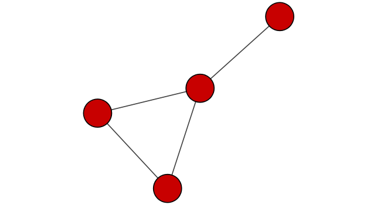
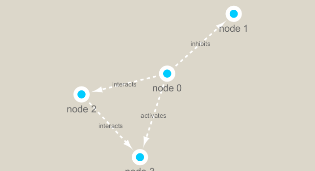

```{r setup, include=FALSE}
knitr::opts_chunk$set(echo = TRUE)
```

```{r}
library(RCy3)
library(igraph)

# Test the connection to Cytoscape.
cytoscapePing()
```
```{r}
#Check the version
cytoscapeVersionInfo()

```
```{r}
#test by making a simple graph
g <- makeSimpleIgraph()
createNetworkFromIgraph(g, "myGraph")
```
```{r}
#include this Cytoscape rendered network image in our report with the following code:
fig <- exportImage(filename="demo", type="png", height=350)

```

```{r}
#Change the visual style
setVisualStyle("Marquee")
```

```{r}
#Add image to R
fig <- exportImage(filename="demo_marquee", type="png", height=350)


```

```{r}
#You can find out what other styles are available and try a couple:
styles <- getVisualStyleNames()
styles
```

```{r}
setVisualStyle("Ripple")
```

```{r}
plot(g)
```

We will read in a species co-occurrence matrix that was calculated using Spearman Rank coefficient. (see reference Lima-Mendez et al. (2015) for details).
```{r}
## scripts for processing located in "inst/data-raw/"
prok_vir_cor <- read.delim("virus_prok_cor_abundant.tsv", stringsAsFactors = FALSE)

## Have a peak at the first 6 rows
head(prok_vir_cor)
```


