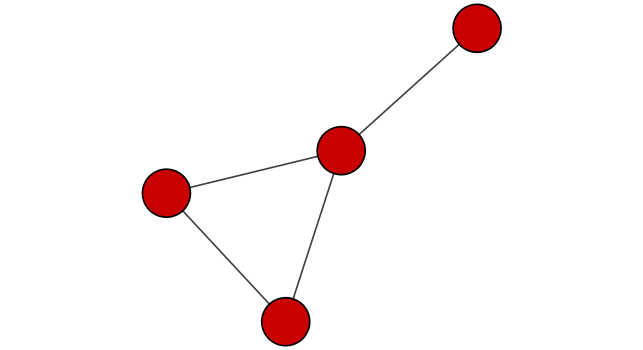
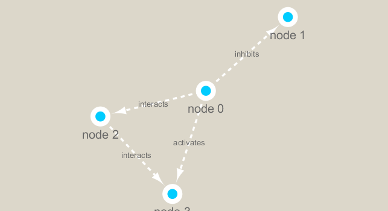
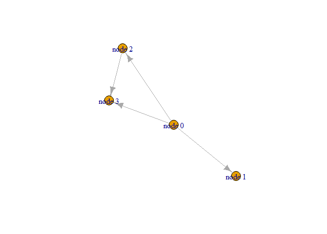

Class 16: Networks
================

``` r
library(RCy3)
library(igraph)
```

    ## 
    ## Attaching package: 'igraph'

    ## The following objects are masked from 'package:stats':
    ## 
    ##     decompose, spectrum

    ## The following object is masked from 'package:base':
    ## 
    ##     union

``` r
# Test the connection to Cytoscape.
cytoscapePing()
```

    ## [1] "You are connected to Cytoscape!"

``` r
#Check the version
cytoscapeVersionInfo()
```

    ##       apiVersion cytoscapeVersion 
    ##             "v1"          "3.7.2"

``` r
#test by making a simple graph
g <- makeSimpleIgraph()
createNetworkFromIgraph(g, "myGraph")
```

    ## Loading data...
    ## Applying default style...
    ## Applying preferred layout...

    ## networkSUID 
    ##          80

``` r
#include this Cytoscape rendered network image in our report with the following code:
fig <- exportImage(filename="demo", type="png", height=350)
```

    ## Warning: This file already exists. A Cytoscape popup 
    ##                 will be generated to confirm overwrite.

``` r

```

<!-- -->

``` r
#Change the visual style
setVisualStyle("Marquee")
```

    ##                 message 
    ## "Visual Style applied."

``` r
#Add image to R
fig <- exportImage(filename="demo_marquee", type="png", height=350)
```

    ## Warning: This file already exists. A Cytoscape popup 
    ##                 will be generated to confirm overwrite.

``` r

```

<!-- -->

``` r
#You can find out what other styles are available and try a couple:
styles <- getVisualStyleNames()
styles
```

    ##  [1] "Sample2"              "BioPAX_SIF"           "Gradient1"           
    ##  [4] "Sample1"              "Directed"             "Solid"               
    ##  [7] "Minimal"              "Sample3"              "Big Labels"          
    ## [10] "size_rank"            "Curved"               "Universe"            
    ## [13] "Marquee"              "Nested Network Style" "Ripple"              
    ## [16] "default"              "default black"        "BioPAX"

``` r
setVisualStyle("Ripple")
```

    ##                 message 
    ## "Visual Style applied."

``` r
plot(g)
```

<!-- -->

We will read in a species co-occurrence matrix that was calculated using
Spearman Rank coefficient. (see reference Lima-Mendez et al. (2015) for
details).

``` r
## scripts for processing located in "inst/data-raw/"
prok_vir_cor <- read.delim("virus_prok_cor_abundant.tsv", stringsAsFactors = FALSE)

## Have a peak at the first 6 rows
head(prok_vir_cor)
```

    ##       Var1          Var2    weight
    ## 1  ph_1061 AACY020068177 0.8555342
    ## 2  ph_1258 AACY020207233 0.8055750
    ## 3  ph_3164 AACY020207233 0.8122517
    ## 4  ph_1033 AACY020255495 0.8487498
    ## 5 ph_10996 AACY020255495 0.8734617
    ## 6 ph_11038 AACY020255495 0.8740782
